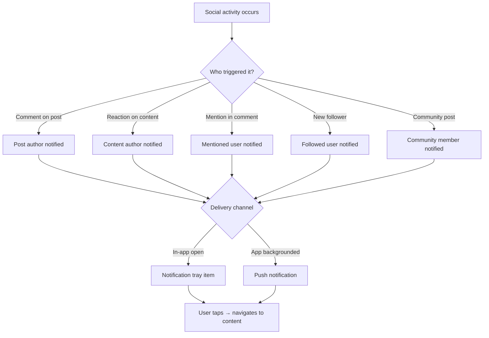

# Notifications & Engagement

<Info>**SDK v6.x** · Last verified March 2026 · iOS · Android · Web · Flutter</Info>

<Accordion title="Speed run — just the code" icon="forward">
```typescript
// 1. Get notification tray items
const { data } = await notificationTray.getNotificationTrayItems({ limit: 20 });

// 2. Mark a notification as seen
await notificationTray.markSeen('notificationId');

// 3. Register push token
await Client.registerPushNotification({
  token: 'fcm-or-apns-token', platform: 'android',
});

// 4. Subscribe to real-time events
Client.onNotification((event) => {
  showBadge(event.unreadCount);
});
```
Full walkthrough below ↓
</Accordion>

Notifications are your primary re-engagement tool. This guide covers building an in-app notification tray with seen/unseen tracking, setting up push notifications across all platforms, and subscribing to real-time social events.



## What You'll Build

<CardGroup cols={4}>
  <Card title="Notification Tray" icon="bell">
    An in-app inbox showing all notifications with seen/unseen state and pagination
  </Card>
  <Card title="Push Notifications" icon="mobile">
    Device push notification registration and platform-specific setup for iOS, Android, and React Native
  </Card>
  <Card title="Real-time Events" icon="bolt">
    Subscribe to social events (reactions, comments, follows) as they happen for live UI updates
  </Card>
  <Card title="Notification Settings" icon="gear">
    Per-user and per-community notification preferences controlled by the user
  </Card>
</CardGroup>

<Info>
**Prerequisites**: SDK installed and authenticated. For push notifications: APNs certificate (iOS) or FCM credentials (Android) configured in **Admin Console → Settings → Integrations**.

**Also recommended:** Complete [Build a Social Feed](/use-cases/social/build-a-social-feed) and [Community Platform](/use-cases/social/community-platform) first — notifications are triggered by feed and community events.
</Info>

<Note>
**After completing this guide you'll have:**
- An in-app notification tray with seen/unseen state and real-time delivery
- Push notifications (APNs and FCM) registered and firing for key events
- Notification triggers mapped to SDK events and webhook callbacks
</Note>

import GetNotificationTrayItems from '/snippets/social/notifications/get-notification-tray-items.mdx';

---

## Quick Start: Query Notification Tray

<GetNotificationTrayItems />

---

## Part 1: In-App Notification Tray

<Steps>
  <Step title="Get unseen notification count">
    Use the tray status to show a badge count on your notification icon. The `unseenCount` updates in real-time.

    ```typescript TypeScript
    import { notificationTray } from '@amityco/ts-sdk';

    const unsubscribe = await notificationTray.getNotificationTraySeen(
      ({ data: notificationTraySeen, loading }) => {
        if (!loading && notificationTraySeen) {
          updateBadge(notificationTraySeen.unseenCount);
        }
      },
    );
    ```

    Full reference → [Notification Tray Status](/social-plus-sdk/social/discovery-engagement/notifications/notification-tray-status)
  </Step>
  <Step title="Mark notifications as seen">
    When the user opens the tray, mark all unseen items as seen. Or mark individual items as seen on tap. Both bulk and per-item marking are supported.

    ```typescript TypeScript
    import { notificationTray } from '@amityco/ts-sdk';

    // Mark all as seen
    await notificationTray.markAllNotificationTrayItemsAsSeen();

    // Or mark a single item
    await item.markSeen();
    ```

    Full reference → [Notification Tray Status](/social-plus-sdk/social/discovery-engagement/notifications/notification-tray-status)
  </Step>
  <Step title="Navigate from a notification tap">
    Each notification item contains `targetType` and `targetId` fields you can use to deep-link to the source content (post, comment, user, or community).

    Reference all notification types → [Notification Events Reference](/social-plus-sdk/social/discovery-engagement/notifications/notification-events-reference)
  </Step>
</Steps>

---

## Part 2: Push Notifications

<Steps>
  <Step title="Configure push credentials in Admin Console">
    Before registering devices, add your push credentials in **Admin Console → Settings → Push Notifications**:
    - **iOS**: Upload your APNs certificate or key
    - **Android**: Add your FCM Server Key
    - **React Native / Flutter**: Configure per platform

    → Platform setup guides: [iOS](/social-plus-sdk/core-concepts/realtime-communication/push-notifications/setup/ios-setup) · [Android](/social-plus-sdk/core-concepts/realtime-communication/push-notifications/setup/android-setup) · [React Native](/social-plus-sdk/core-concepts/realtime-communication/push-notifications/setup/react-native-setup) · [Flutter](/social-plus-sdk/core-concepts/realtime-communication/push-notifications/setup/flutter-setup)
  </Step>
  <Step title="Register the device for push">
    After the user logs in, retrieve the device token and register it with the SDK. This associates the device with the authenticated user so the backend can route pushes correctly.

    <CodeGroup>
    ```swift iOS
    // Call after login completes, passing the APNs device token
    do {
        try await client.registerPushNotification(withDeviceToken: deviceToken)
    } catch {
        print("Push registration failed: \(error)")
    }
    ```

    ```kotlin Android
    // Call after login completes, using the FCM token
    AmityCoreClient.registerPushNotification()
        .doOnComplete {
            // Registration successful
        }
        .doOnError { error ->
            // Handle error
        }
        .subscribe()
    ```

    ```dart Flutter
    // Pass the FCM token obtained from FirebaseMessaging.instance.getToken()
    AmityCoreClient.registerDeviceNotification(fcmToken)
        .then((_) {
            // Registration successful
        })
        .onError((error, _) {
            // Handle error
        });
    ```
    </CodeGroup>

    Full reference → [Register Push Notifications](/social-plus-sdk/core-concepts/realtime-communication/push-notifications/register-and-unregister-push-notifications-on-a-device)
  </Step>
  <Step title="Unregister on logout">
    Always unregister the device token when the user logs out to prevent push notifications being sent to the wrong user's device.

    <CodeGroup>
    ```swift iOS
    // Pass the userId to unregister only this user from this device
    client.unregisterDeviceForPushNotification(forUserId: userId) { _, success, error in
        // Handle response
    }
    ```

    ```kotlin Android
    AmityCoreClient.unregisterPushNotification()
        .doOnComplete {
            // Unregistration successful
        }
        .doOnError { error ->
            // Handle error
        }
        .subscribe()
    ```

    ```dart Flutter
    AmityCoreClient.unregisterDeviceNotification()
        .then((_) {
            // Unregistration successful
        })
        .onError((error, _) {
            // Handle error
        });
    ```
    </CodeGroup>

    Full reference → [Register Push Notifications](/social-plus-sdk/core-concepts/realtime-communication/push-notifications/register-and-unregister-push-notifications-on-a-device)
  </Step>
</Steps>

---

## Part 3: User Notification Preferences

Let users control what they're notified about at a granular level. Settings are organised by module (`SOCIAL`, `CHAT`, `LIVE_STREAM`) and apply across all of the user's devices.

<Steps>
  <Step title="Get current notification settings">
    Read the user's current preferences to populate a settings screen.

    <CodeGroup>
    ```swift iOS
    let userNotificationManager = client.notificationManager

    do {
        let notification = try await userNotificationManager.getSettings()
        print("Notifications enabled: \(notification.isEnabled)")

        for module in notification.modules {
            switch module.moduleType {
            case .social: print("Social: \(module.isEnabled)")
            case .chat:   print("Chat: \(module.isEnabled)")
            case .videoStreaming: print("Live stream: \(module.isEnabled)")
            @unknown default: break
            }
        }
    } catch {
        print("Failed to get settings: \(error)")
    }
    ```

    ```kotlin Android
    AmityCoreClient.notifications().user()
        .getSettings()
        .doOnSuccess { settings ->
            val isEnabled = settings.isEnabled()
            settings.getModules()?.forEach { module ->
                when (module) {
                    is AmityUserNotificationModule.SOCIAL ->
                        println("Social: ${module.isEnabled()}")
                    is AmityUserNotificationModule.CHAT ->
                        println("Chat: ${module.isEnabled()}")
                    is AmityUserNotificationModule.VIDEO_STREAMING ->
                        println("Live stream: ${module.isEnabled()}")
                    else -> {}
                }
            }
        }
        .doOnError { /* Handle error */ }
        .subscribe()
    ```
    </CodeGroup>
  </Step>
  <Step title="Update notification module settings">
    Enable or disable individual modules, or turn off all notifications at once.

    <CodeGroup>
    ```swift iOS
    // Disable social notifications, keep chat enabled
    do {
        try await userNotificationManager.enable(for: [
            AmityUserNotificationModule(moduleType: .social, isEnabled: false, roleFilter: nil),
            AmityUserNotificationModule(moduleType: .chat,   isEnabled: true,  roleFilter: nil)
        ])
    } catch {
        print("Update failed: \(error)")
    }

    // Or disable everything at once
    try await userNotificationManager.disableAllNotifications()
    ```

    ```kotlin Android
    val socialModule = AmityUserNotificationModule.SOCIAL.disable()
    val chatModule   = AmityUserNotificationModule.CHAT.enable()

    AmityCoreClient.notifications()
        .user()
        .enable(moduleModifiers = listOf(socialModule, chatModule))
        .doOnComplete { /* Updated */ }
        .doOnError    { /* Handle error */ }
        .subscribe()
    ```
    </CodeGroup>

    Full reference → [User Notification Settings](/social-plus-sdk/core-concepts/realtime-communication/push-notifications/settings/user-settings)
  </Step>
  <Step title="Configure community-level settings (optional)">
    For finer control, users can configure which notification types they receive per community (new post, new comment, mentions). This is separate from the global user setting above.

    Full reference → [Community Notification Settings](/social-plus-sdk/core-concepts/realtime-communication/push-notifications/settings/community-settings)
  </Step>
</Steps>

---

## 🔗 Connect to Moderation & Analytics

<AccordionGroup>
  <Accordion title="Webhook: trigger notifications for moderation actions" icon="webhook">
    When a moderator removes content, use webhook events (`post.deleted`, `user.banned`) to send a custom in-app or push notification explaining the action to the affected user.

    → [Webhook Events](/analytics-and-moderation/social+-apis-and-services/webhook-event)
  </Accordion>
  <Accordion title="Notification analytics" icon="chart-bar">
    Track notification open rates and click-through rates in **Admin Console → Analytics Dashboard → Engagement Metrics** to understand which notification types drive the most re-engagement.
  </Accordion>
</AccordionGroup>

---

## Common Mistakes

<Warning>
**Polling for notifications on a timer** — This drains battery and creates unnecessary API calls. Use real-time event subscriptions with `Client.onNotification()` instead.

```typescript
// ❌ Bad — polling every 5 seconds
setInterval(() => fetchNotifications(), 5000);

// ✅ Good — real-time subscription
Client.onNotification((event) => {
  updateBadge(event.unreadCount);
});
```
</Warning>

<Warning>
**Not handling push permission rejection** — On iOS, users can deny push permissions. Always check the permission status and provide an in-app fallback (notification tray) when push is disabled.
</Warning>

<Warning>
**Registering push tokens before login** — Push token registration requires an active session. Always call `registerPushNotification` after `login()` completes, not in parallel.
</Warning>

## Best Practices

<AccordionGroup>
  <Accordion title="Notification tray UX" icon="bell">
    - Group related notifications (e.g., "5 reactions on your post") instead of showing individual items
    - Show a relative timestamp ("2 min ago") that updates while the tray is open
    - Mark all as seen when the tray is closed, not opened — allows the user to scan without losing unseen state
    - Include a thumbnail of the content the notification relates to
  </Accordion>
  <Accordion title="Push notification best practices" icon="mobile">
    - Keep push payloads minimal — fetch full content on tap, not in the payload
    - Include `userId` in the notification payload to support multi-account scenarios
    - Group pushes by thread on iOS using `threadIdentifier`
    - Respect iOS Critical Alert restrictions — social notifications should never be critical
  </Accordion>
  <Accordion title="Avoiding notification fatigue" icon="bell-slash">
    - Default to email digest for low-activity users rather than per-event push
    - Respect platform quiet hours (iOS Focus mode, Android DND)
    - Provide granular opt-out: users should be able to mute a specific community without turning off all notifications
    - Rate-limit push if a post gets hundreds of reactions — send "50+ reactions on your post" not one push per reaction
  </Accordion>
</AccordionGroup>

---

## Next Steps

<Card
  title="Your next step → Content Moderation Pipeline"
  icon="arrow-right"
  href="/use-cases/social/content-moderation-pipeline"
>
  Notifications are flowing — now ensure content quality with flagging, AI moderation, and admin review.
</Card>

Or explore related guides:

<CardGroup cols={3}>
  <Card title="User Profiles & Social Graph" href="/use-cases/social/user-profiles-and-social-graph" icon="user-group">
    Follow activity that drives notification events
  </Card>
  <Card title="Comments & Reactions" href="/use-cases/social/comments-and-reactions" icon="comments">
    Engagement events that trigger notification items
  </Card>
  <Card title="Content Moderation Pipeline" href="/use-cases/social/content-moderation-pipeline" icon="shield-check">
    Use webhooks to notify users of moderation actions
  </Card>
</CardGroup>
