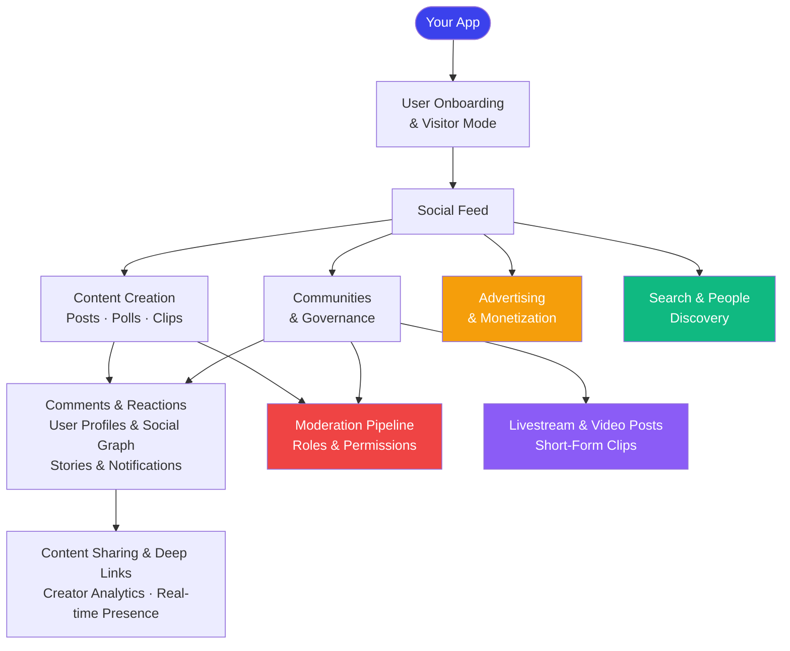

# Social Use Cases

Build a complete social experience. Each guide below walks through one core social feature end-to-end with SDK implementation steps and links to real, copy-paste-ready code examples.

## Core Concepts at a Glance

New to social.plus? Here's how the key building blocks relate to each other before you pick a guide.

| Term | What it is |
|---|---|
| **Post** | The primary content unit. Can be text, image, video, poll, clip, or livestream. Always targets a community or a user's profile feed. |
| **Community** | A group space where users gather, share posts, and interact. Has members, roles, and its own feed. |
| **Feed** | A container that groups posts for a target (community or user). Has three states: `published`, `reviewing`, and `declined`. |
| **Comment** | A reply attached to a post or story. Supports two levels of threading (comments and replies). |
| **Reaction** | A named emoji response (e.g. `"like"`, `"love"`) on a post, comment, or story. Each reaction is a separate document — freeform names, not a fixed set. |
| **Story** | Ephemeral content (image or video) visible for 24 hours. Targets a community or user profile. |
| **Poll** | An interactive vote with up to 10 options, always embedded inside a post. Supports single or multiple choice with an optional expiry timer. |
| **Room** | A live broadcast session. Always hosted inside a community. Has a lifecycle: `idle → live → ended → recorded`. |
| **Follow** | A user-to-user relationship with status: `pending`, `accepted`, or `blocked`. |
| **Reaction name** | Freeform string — you define your own set (e.g. `"like"`, `"heart"`, `"clap"`). The SDK has no fixed enum for reaction types. |

<Info>
For the complete field-level reference — types, enums, and entity relationships — see the [Social Data Model](/api-reference/social-data-model).
</Info>

---

---

## Building Blocks

Start here if you're building from scratch. These guides cover the core social primitives every app needs.

<CardGroup cols={2}>
  <Card
    title="Build a Social Feed"
    icon="rectangle-list"
    href="/use-cases/social/build-a-social-feed"
  >
    **Start here.** Query user feeds, community feeds, and a global aggregated feed. Add real-time updates and custom post ranking.
    
    SDK: Feed queries · Live Collections · Custom ranking
  </Card>
  <Card
    title="Rich Content Creation"
    icon="pen-to-square"
    href="/use-cases/social/rich-content-creation"
  >
    Let users create text, image, video, poll, and file posts. Add @mentions, hashtags, link previews, and product tagging.
    
    SDK: 11 post types · Media upload API
  </Card>
  <Card
    title="Comments & Reactions"
    icon="comments"
    href="/use-cases/social/comments-and-reactions"
  >
    Add threaded comments with @mentions, and emoji reactions on posts, comments, and stories. Real-time updates included.
    
    SDK: Comment CRUD · Reaction add/remove/query
  </Card>
  <Card
    title="Community Platform"
    icon="users"
    href="/use-cases/social/community-platform"
  >
    Create public and private communities with member roles, content moderation, categories, and trending discovery.
    
    SDK: Community lifecycle · Governance · Membership
  </Card>
  <Card
    title="User Onboarding & Visitor Mode"
    icon="door-open"
    href="/use-cases/social/user-onboarding-and-visitor-mode"
  >
    Let users explore content before signing up. Handle visitor-to-authenticated transitions and profile setup.
    
    SDK: Visitor mode · Session handler · Profile setup
  </Card>
  <Card
    title="Polls & Interactive Content"
    icon="square-poll-vertical"
    href="/use-cases/social/polls-and-interactive-content"
  >
    Create single or multiple-choice polls embedded in feed posts. Vote, change votes, and close or delete polls.
    
    SDK: Poll lifecycle · Voting · Poll posts
  </Card>
</CardGroup>

---

## Engagement & Growth

Once your core content loop works, use these guides to drive retention and deeper social connections.

<CardGroup cols={2}>
  <Card
    title="User Profiles & Social Graph"
    icon="user-group"
    href="/use-cases/social/user-profiles-and-social-graph"
  >
    Build user profiles, follow/unfollow with connection requests, bidirectional blocking, and follower/following lists.
    
    SDK: User management · Following · Blocking
  </Card>
  <Card
    title="Stories & Ephemeral Content"
    icon="circle-play"
    href="/use-cases/social/stories-and-ephemeral-content"
  >
    Add image and video stories with story rings, view counts, impression analytics, and per-community or per-user targeting.
    
    SDK: Story creation · Retrieval · Story analytics
  </Card>
  <Card
    title="Notifications & Engagement"
    icon="bell"
    href="/use-cases/social/notifications-and-engagement"
  >
    Build a notification inbox with seen/unseen state, real-time delivery, push notification setup, and event-based triggers.
    
    SDK: Notification tray · Push notifications · Real-time events
  </Card>
  <Card
    title="Events & Activities"
    icon="calendar"
    href="/use-cases/social/events-and-activities"
  >
    Create structured events with RSVP, attendance tracking, event discovery, and calendar integration.
    
    SDK: Events CRUD · RSVP management
  </Card>
  <Card
    title="Content Sharing & Deep Links"
    icon="share-nodes"
    href="/use-cases/social/content-sharing-and-deep-links"
  >
    Generate shareable URLs for posts, communities, and users. Handle deep links to route users directly to content.
    
    SDK: Share link config · URL patterns · Deep linking
  </Card>
  <Card
    title="Real-time Presence & Activity"
    icon="signal"
    href="/use-cases/social/realtime-presence-and-activity"
  >
    Show online/offline indicators, track channel presence, and subscribe to real-time events across the platform.
    
    SDK: Presence manager · Channel presence · Event topics
  </Card>
  <Card
    title="Post Impressions & Creator Analytics"
    icon="chart-line"
    href="/use-cases/social/post-impressions-and-creator-analytics"
  >
    Track post views and unique reach, query who viewed each post, and build creator analytics dashboards.
    
    SDK: markAsViewed · impression · reach · getViewedUsers
  </Card>
</CardGroup>

---

## Discovery & Safety

Make content discoverable and keep your platform safe.

<CardGroup cols={2}>
  <Card
    title="Search & Discovery"
    icon="magnifying-glass"
    href="/use-cases/social/search-and-discovery"
  >
    Add full-text post search, community search, trending communities, content recommendations, and category browsing.
    
    SDK: Intelligent search · Trending/recommended communities
  </Card>
  <Card
    title="Content Moderation Pipeline"
    icon="shield-check"
    href="/use-cases/social/content-moderation-pipeline"
  >
    Wire up the full moderation loop: user-reported content → admin review → AI moderation → webhook automation → SDK flagging.
    
    SDK: Flag/unflag APIs · API: Webhooks · Console: AI moderation
  </Card>
  <Card
    title="Roles, Permissions & Governance"
    icon="user-shield"
    href="/use-cases/social/roles-permissions-and-governance"
  >
    Check permissions before actions, assign community moderator roles, configure post review, and manage bans.
    
    SDK: Permission checks · Role assignment · Ban management
  </Card>
  <Card
    title="User Search & People Discovery"
    icon="user-magnifying-glass"
    href="/use-cases/social/user-search-and-people-discovery"
  >
    Search users by display name, browse user directories, build "People you may know" suggestions, and follow from search results.
    
    SDK: User search · User queries · Follow from results
  </Card>
</CardGroup>

---

## Video & Monetization

Expand your platform with live video and revenue-generating features.

<CardGroup cols={2}>
  <Card
    title="Livestream & Video Posts"
    icon="tower-broadcast"
    href="/use-cases/social/livestream-and-video-posts"
  >
    Go live in communities with broadcast rooms, co-hosting, live chat, and recorded playback after the stream ends.
    
    SDK: Room management · LiveKit broadcasting · Recordings
  </Card>
  <Card
    title="Short-Form Video Clips"
    icon="film"
    href="/use-cases/social/short-form-video-clips"
  >
    Build a TikTok-style clip reel — upload videos up to 15 min, publish clip posts, auto-play in feeds, and track impressions.
    
    SDK: Clip post creation · Video upload · Display modes
  </Card>
  <Card
    title="Advertising & Monetization"
    icon="rectangle-ad"
    href="/use-cases/social/advertising-and-monetization"
  >
    Display native ads in feeds, track impressions and clicks, and configure ad frequency through the Admin Console.
    
    SDK: Ad repository · Impression tracking · Click tracking
  </Card>
</CardGroup>

---

## Suggested Learning Paths

<AccordionGroup>
  <Accordion title="Building a social media app (Instagram-like)" icon="image">
    1. [User Onboarding & Visitor Mode](/use-cases/social/user-onboarding-and-visitor-mode) — let users explore before signing up
    2. [Build a Social Feed](/use-cases/social/build-a-social-feed) — your home timeline
    3. [Rich Content Creation](/use-cases/social/rich-content-creation) — photo and video posts
    4. [Comments & Reactions](/use-cases/social/comments-and-reactions) — likes and comment threads
    5. [Stories & Ephemeral Content](/use-cases/social/stories-and-ephemeral-content) — 24-hour stories
    6. [User Profiles & Social Graph](/use-cases/social/user-profiles-and-social-graph) — follow system
    7. [Notifications & Engagement](/use-cases/social/notifications-and-engagement) — activity feed
    8. [Content Sharing & Deep Links](/use-cases/social/content-sharing-and-deep-links) — shareable post URLs
    9. [Content Moderation Pipeline](/use-cases/social/content-moderation-pipeline) — keep it safe
  </Accordion>
  <Accordion title="Building a community platform (Reddit/Discord-like)" icon="users">
    1. [Community Platform](/use-cases/social/community-platform) — your communities backbone
    2. [Roles, Permissions & Governance](/use-cases/social/roles-permissions-and-governance) — moderator roles and post review
    3. [Rich Content Creation](/use-cases/social/rich-content-creation) — posts and polls
    4. [Comments & Reactions](/use-cases/social/comments-and-reactions) — discussions
    5. [Build a Social Feed](/use-cases/social/build-a-social-feed) — community feeds
    6. [Search & Discovery](/use-cases/social/search-and-discovery) — find communities
    7. [User Search & People Discovery](/use-cases/social/user-search-and-people-discovery) — find people
    8. [Content Moderation Pipeline](/use-cases/social/content-moderation-pipeline) — community rules
    9. [Notifications & Engagement](/use-cases/social/notifications-and-engagement) — alerts
  </Accordion>
  <Accordion title="Building a live-streaming app (Twitch-like)" icon="video">
    1. [Livestream & Video Posts](/use-cases/social/livestream-and-video-posts) — broadcast rooms and go-live flow
    2. [Community Platform](/use-cases/social/community-platform) — stream communities
    3. [Real-time Presence & Activity](/use-cases/social/realtime-presence-and-activity) — "Live Now" indicators
    4. [Comments & Reactions](/use-cases/social/comments-and-reactions) — live chat reactions
    5. [User Profiles & Social Graph](/use-cases/social/user-profiles-and-social-graph) — follow streamers
    6. [Notifications & Engagement](/use-cases/social/notifications-and-engagement) — "X just went live" alerts
    7. [Advertising & Monetization](/use-cases/social/advertising-and-monetization) — in-feed ads
  </Accordion>
  <Accordion title="Adding social to an existing app" icon="plug">
    1. [User Onboarding & Visitor Mode](/use-cases/social/user-onboarding-and-visitor-mode) — integrate with your auth
    2. [Rich Content Creation](/use-cases/social/rich-content-creation) — let users post
    3. [Comments & Reactions](/use-cases/social/comments-and-reactions) — engagement on existing content
    4. [User Profiles & Social Graph](/use-cases/social/user-profiles-and-social-graph) — connect users
    5. [Notifications & Engagement](/use-cases/social/notifications-and-engagement) — bring users back
    6. [Content Moderation Pipeline](/use-cases/social/content-moderation-pipeline) — moderate at scale
  </Accordion>
</AccordionGroup>
