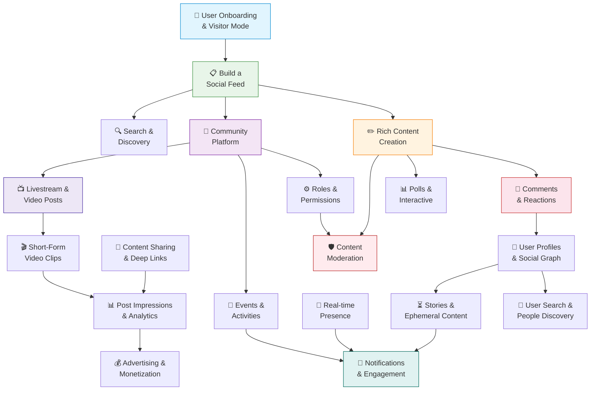

Build a complete social experience. Each guide below walks through one core social feature end-to-end with SDK implementation steps and links to real, copy-paste-ready code examples.

## Core Concepts at a Glance

New to social.plus? Expand any term to understand the building blocks before picking a guide.

<AccordionGroup>
  <Accordion title="Post" icon="file-lines">
    The primary content unit. Can be `text`, `image`, `video`, `poll`, `clip`, or `livestream`. Always targets either a **community** or a **user's profile feed** as its destination.
  </Accordion>
  <Accordion title="Community" icon="users">
    A group space where users gather, share posts, and interact. Has members, roles (member / moderator), and its own feed. Can be `public` or `private`.
  </Accordion>
  <Accordion title="Feed" icon="rectangle-list">
    A container that groups posts for a target (community or user). Returns posts with three possible review states: `published`, `reviewing`, and `declined`.
  </Accordion>
  <Accordion title="Comment" icon="comment">
    A reply attached to a post or story. Supports two levels of threading: top-level **comments** and nested **replies**. Both have full CRUD and real-time updates.
  </Accordion>
  <Accordion title="Reaction" icon="face-smile">
    A named emoji response on a post, comment, or story. Each reaction is its own document — names are freeform strings you define (e.g. `"like"`, `"love"`, `"clap"`). No fixed SDK enum.
  </Accordion>
  <Accordion title="Story" icon="circle-play">
    Ephemeral content (image or video) visible for 24 hours. Targets a community or user profile. Supports per-story view counts and impression analytics.
  </Accordion>
  <Accordion title="Poll" icon="square-poll-vertical">
    An interactive vote with up to 10 options, always embedded inside a post. Supports single or multiple choice with an optional expiry timer. Voters can change their vote until the poll closes.
  </Accordion>
  <Accordion title="Room" icon="broadcast-tower">
    A live broadcast session. Always hosted inside a community. Lifecycle: `idle → live → ended → recorded`. Supports co-hosts and live chat during broadcast.
  </Accordion>
  <Accordion title="Follow" icon="user-plus">
    A user-to-user relationship with status: `pending`, `accepted`, or `blocked`. Drives what appears in the user's home feed and social graph.
  </Accordion>
  <Accordion title="Reaction name" icon="tag">
    Freeform string — you define your own reaction set (e.g. `"like"`, `"heart"`, `"clap"`, `"fire"`). The SDK has no fixed enum — configure your set in the Admin Console.
  </Accordion>
</AccordionGroup>

<Info>
For the complete field-level reference — types, enums, and entity relationships — see the [Social Data Model](/api-reference/social-data-model).
</Info>

---

<Card
  title="🚀 Tutorial: Build a Complete Social App"
  icon="map"
  href="/use-cases/social/build-a-complete-social-app"
>
  Follow a 6-phase guided tutorial from onboarding → feeds → content → engagement → communities → notifications. Build a fully-featured social app in ~2.5 hours.
</Card>

---

## Guide Map

How the guides connect. Follow the arrows for the recommended build order, or jump to any guide directly.

---

## Building Blocks

Start here if you're building from scratch. These guides cover the core social primitives every app needs.

<CardGroup cols={2}>
  <Card
    title="Build a Social Feed"
    icon="rectangle-list"
    href="/use-cases/social/build-a-social-feed"
  >
    **Start here.** Query user feeds, community feeds, and a global aggregated feed. Add real-time updates and custom post ranking.
    
    SDK: Feed queries · Live Collections · Custom ranking · `~20 min` · `Beginner`
  </Card>
  <Card
    title="Rich Content Creation"
    icon="pen-to-square"
    href="/use-cases/social/rich-content-creation"
  >
    Let users create text, image, video, poll, and file posts. Add @mentions, hashtags, link previews, and product tagging.
    
    SDK: 11 post types · Media upload API · `~25 min` · `Intermediate`
  </Card>
  <Card
    title="Comments & Reactions"
    icon="comments"
    href="/use-cases/social/comments-and-reactions"
  >
    Add threaded comments with @mentions, and emoji reactions on posts, comments, and stories. Real-time updates included.
    
    SDK: Comment CRUD · Reaction add/remove/query · `~15 min` · `Beginner`
  </Card>
  <Card
    title="Community Platform"
    icon="users"
    href="/use-cases/social/community-platform"
  >
    Create public and private communities with member roles, content moderation, categories, and trending discovery.
    
    SDK: Community lifecycle · Governance · Membership · `~25 min` · `Intermediate`
  </Card>
  <Card
    title="User Onboarding & Visitor Mode"
    icon="door-open"
    href="/use-cases/social/user-onboarding-and-visitor-mode"
  >
    Let users explore content before signing up. Handle visitor-to-authenticated transitions and profile setup.
    
    SDK: Visitor mode · Session handler · Profile setup · `~20 min` · `Beginner`
  </Card>
  <Card
    title="Polls & Interactive Content"
    icon="square-poll-vertical"
    href="/use-cases/social/polls-and-interactive-content"
  >
    Create single or multiple-choice polls embedded in feed posts. Vote, change votes, and close or delete polls.
    
    SDK: Poll lifecycle · Voting · Poll posts · `~15 min` · `Beginner`
  </Card>
</CardGroup>

---

## Engagement & Growth

Once your core content loop works, use these guides to drive retention and deeper social connections.

<CardGroup cols={2}>
  <Card
    title="User Profiles & Social Graph"
    icon="user-group"
    href="/use-cases/social/user-profiles-and-social-graph"
  >
    Build user profiles, follow/unfollow with connection requests, bidirectional blocking, and follower/following lists.
    
    SDK: User management · Following · Blocking · `~20 min` · `Beginner`
  </Card>
  <Card
    title="Stories & Ephemeral Content"
    icon="circle-play"
    href="/use-cases/social/stories-and-ephemeral-content"
  >
    Add image and video stories with story rings, view counts, impression analytics, and per-community or per-user targeting.
    
    SDK: Story creation · Retrieval · Story analytics · `~20 min` · `Intermediate`
  </Card>
  <Card
    title="Notifications & Engagement"
    icon="bell"
    href="/use-cases/social/notifications-and-engagement"
  >
    Build a notification inbox with seen/unseen state, real-time delivery, push notification setup, and event-based triggers.
    
    SDK: Notification tray · Push notifications · Real-time events · `~30 min` · `Advanced`
  </Card>
  <Card
    title="Events & Activities"
    icon="calendar"
    href="/use-cases/social/events-and-activities"
  >
    Create structured events with RSVP, attendance tracking, event discovery, and calendar integration.
    
    SDK: Events CRUD · RSVP management · `~20 min` · `Intermediate`
  </Card>
  <Card
    title="Content Sharing & Deep Links"
    icon="share-nodes"
    href="/use-cases/social/content-sharing-and-deep-links"
  >
    Generate shareable URLs for posts, communities, and users. Handle deep links to route users directly to content.
    
    SDK: Share link config · URL patterns · Deep linking · `~15 min` · `Beginner`
  </Card>
  <Card
    title="Real-time Presence & Activity"
    icon="signal"
    href="/use-cases/social/realtime-presence-and-activity"
  >
    Show online/offline indicators, track channel presence, and subscribe to real-time events across the platform.
    
    SDK: Presence manager · Channel presence · Event topics · `~25 min` · `Intermediate`
  </Card>
  <Card
    title="Post Impressions & Creator Analytics"
    icon="chart-line"
    href="/use-cases/social/post-impressions-and-creator-analytics"
  >
    Track post views and unique reach, query who viewed each post, and build creator analytics dashboards.
    
    SDK: markAsViewed · impression · reach · getViewedUsers · `~15 min` · `Beginner`
  </Card>
</CardGroup>

---

## Discovery & Safety

Make content discoverable and keep your platform safe.

<CardGroup cols={2}>
  <Card
    title="Search & Discovery"
    icon="magnifying-glass"
    href="/use-cases/social/search-and-discovery"
  >
    Add full-text post search, community search, trending communities, content recommendations, and category browsing.
    
    SDK: Intelligent search · Trending/recommended communities · `~15 min` · `Beginner`
  </Card>
  <Card
    title="Content Moderation Pipeline"
    icon="shield-check"
    href="/use-cases/social/content-moderation-pipeline"
  >
    Wire up the full moderation loop: user-reported content → admin review → AI moderation → webhook automation → SDK flagging.
    
    SDK: Flag/unflag APIs · API: Webhooks · Console: AI moderation · `~30 min` · `Advanced`
  </Card>
  <Card
    title="Roles, Permissions & Governance"
    icon="user-shield"
    href="/use-cases/social/roles-permissions-and-governance"
  >
    Check permissions before actions, assign community moderator roles, configure post review, and manage bans.
    
    SDK: Permission checks · Role assignment · Ban management · `~20 min` · `Intermediate`
  </Card>
  <Card
    title="User Search & People Discovery"
    icon="user-magnifying-glass"
    href="/use-cases/social/user-search-and-people-discovery"
  >
    Search users by display name, browse user directories, build "People you may know" suggestions, and follow from search results.
    
    SDK: User search · User queries · Follow from results · `~15 min` · `Beginner`
  </Card>
</CardGroup>

---

## Video & Monetization

Expand your platform with live video and revenue-generating features.

<CardGroup cols={2}>
  <Card
    title="Livestream & Video Posts"
    icon="tower-broadcast"
    href="/use-cases/social/livestream-and-video-posts"
  >
    Go live in communities with broadcast rooms, co-hosting, live chat, and recorded playback after the stream ends.
    
    SDK: Room management · LiveKit broadcasting · Recordings · `~30 min` · `Advanced`
  </Card>
  <Card
    title="Short-Form Video Clips"
    icon="film"
    href="/use-cases/social/short-form-video-clips"
  >
    Build a TikTok-style clip reel — upload videos up to 15 min, publish clip posts, auto-play in feeds, and track impressions.
    
    SDK: Clip post creation · Video upload · Display modes · `~20 min` · `Intermediate`
  </Card>
  <Card
    title="Advertising & Monetization"
    icon="rectangle-ad"
    href="/use-cases/social/advertising-and-monetization"
  >
    Display native ads in feeds, track impressions and clicks, and configure ad frequency through the Admin Console.
    
    SDK: Ad repository · Impression tracking · Click tracking · `~15 min` · `Beginner`
  </Card>
</CardGroup>

---

## Start by App Type

Not sure which guide to open first? Pick your app type for a recommended build order.

<Tabs>
  <Tab title="Social / Lifestyle">
    Building a general social app, lifestyle community, or content-sharing platform (Instagram, BeReal, Strava).

    <Steps>
      <Step title="User Onboarding & Visitor Mode">
        Let users explore before signing up. → [Guide](/use-cases/social/user-onboarding-and-visitor-mode)
      </Step>
      <Step title="Build a Social Feed">
        Your home timeline — the core loop. → [Guide](/use-cases/social/build-a-social-feed)
      </Step>
      <Step title="Rich Content Creation">
        Let users post text, images, video, and polls. → [Guide](/use-cases/social/rich-content-creation)
      </Step>
      <Step title="Comments & Reactions">
        Likes, comments, threads. → [Guide](/use-cases/social/comments-and-reactions)
      </Step>
      <Step title="Stories & Ephemeral Content">
        24-hour stories on profiles and communities. → [Guide](/use-cases/social/stories-and-ephemeral-content)
      </Step>
      <Step title="User Profiles & Social Graph">
        Follow system and profile pages. → [Guide](/use-cases/social/user-profiles-and-social-graph)
      </Step>
      <Step title="Notifications & Engagement">
        Activity feed and push notifications. → [Guide](/use-cases/social/notifications-and-engagement)
      </Step>
      <Step title="Content Sharing & Deep Links">
        Shareable post URLs. → [Guide](/use-cases/social/content-sharing-and-deep-links)
      </Step>
      <Step title="Content Moderation Pipeline">
        Keep it safe. → [Guide](/use-cases/social/content-moderation-pipeline)
      </Step>
    </Steps>
  </Tab>

  <Tab title="Community / Forum">
    Building a community-driven platform with discussions, moderation, and discovery (Reddit, Discord, Facebook Groups).

    <Steps>
      <Step title="Community Platform">
        Your communities backbone — groups, categories, membership. → [Guide](/use-cases/social/community-platform)
      </Step>
      <Step title="Roles, Permissions & Governance">
        Moderator roles, post review, bans. → [Guide](/use-cases/social/roles-permissions-and-governance)
      </Step>
      <Step title="Rich Content Creation">
        Posts and polls inside communities. → [Guide](/use-cases/social/rich-content-creation)
      </Step>
      <Step title="Comments & Reactions">
        Threaded discussions. → [Guide](/use-cases/social/comments-and-reactions)
      </Step>
      <Step title="Build a Social Feed">
        Community feeds and global discovery feed. → [Guide](/use-cases/social/build-a-social-feed)
      </Step>
      <Step title="Search & Discovery">
        Find communities, trending topics. → [Guide](/use-cases/social/search-and-discovery)
      </Step>
      <Step title="Content Moderation Pipeline">
        Community rules enforcement. → [Guide](/use-cases/social/content-moderation-pipeline)
      </Step>
      <Step title="Notifications & Engagement">
        Alerts and activity updates. → [Guide](/use-cases/social/notifications-and-engagement)
      </Step>
    </Steps>
  </Tab>

  <Tab title="Fitness / Health">
    Building a fitness tracker, health community, or workout-sharing app (Strava, Nike Run Club, MyFitnessPal).

    <Steps>
      <Step title="User Profiles & Social Graph">
        Athlete profiles, friends, followers. → [Guide](/use-cases/social/user-profiles-and-social-graph)
      </Step>
      <Step title="Build a Social Feed">
        Activity feed of workouts and achievements. → [Guide](/use-cases/social/build-a-social-feed)
      </Step>
      <Step title="Comments & Reactions">
        High-fives and encouragement. → [Guide](/use-cases/social/comments-and-reactions)
      </Step>
      <Step title="Events & Activities">
        Run clubs, group challenges, virtual races. → [Guide](/use-cases/social/events-and-activities)
      </Step>
      <Step title="Community Platform">
        Sport-specific communities. → [Guide](/use-cases/social/community-platform)
      </Step>
      <Step title="Post Impressions & Creator Analytics">
        Track reach and engagement. → [Guide](/use-cases/social/post-impressions-and-creator-analytics)
      </Step>
    </Steps>
  </Tab>

  <Tab title="Gaming / Esports">
    Building a gaming community, esports platform, or game companion app (Discord, Twitch).

    <Steps>
      <Step title="Community Platform">
        Clan and team spaces. → [Guide](/use-cases/social/community-platform)
      </Step>
      <Step title="Roles, Permissions & Governance">
        Mod tools, clan leadership, permission gates. → [Guide](/use-cases/social/roles-permissions-and-governance)
      </Step>
      <Step title="Livestream & Video Posts">
        In-game streams and VODs. → [Guide](/use-cases/social/livestream-and-video-posts)
      </Step>
      <Step title="Real-time Presence & Activity">
        "Online now" indicators across the platform. → [Guide](/use-cases/social/realtime-presence-and-activity)
      </Step>
      <Step title="Stories & Ephemeral Content">
        Post-match highlights, tournament clips. → [Guide](/use-cases/social/stories-and-ephemeral-content)
      </Step>
      <Step title="Notifications & Engagement">
        Match alerts, tournament updates. → [Guide](/use-cases/social/notifications-and-engagement)
      </Step>
    </Steps>
  </Tab>

  <Tab title="Marketplace">
    Building a marketplace, creator economy, or social commerce platform (Depop, Etsy).

    <Steps>
      <Step title="User Onboarding & Visitor Mode">
        Let browsers explore before signing up. → [Guide](/use-cases/social/user-onboarding-and-visitor-mode)
      </Step>
      <Step title="User Search & People Discovery">
        Find sellers, creators, and brands. → [Guide](/use-cases/social/user-search-and-people-discovery)
      </Step>
      <Step title="Content Sharing & Deep Links">
        Share product pages and listings. → [Guide](/use-cases/social/content-sharing-and-deep-links)
      </Step>
      <Step title="Advertising & Monetization">
        Native ads in the browse feed. → [Guide](/use-cases/social/advertising-and-monetization)
      </Step>
      <Step title="Content Moderation Pipeline">
        Keep listings and reviews safe. → [Guide](/use-cases/social/content-moderation-pipeline)
      </Step>
    </Steps>
  </Tab>

  <Tab title="Livestream">
    Building a live-streaming platform with interactive chat (Twitch, YouTube Live, Instagram Live).

    <Steps>
      <Step title="Livestream & Video Posts">
        Broadcast rooms, co-hosting, go-live flow. → [Guide](/use-cases/social/livestream-and-video-posts)
      </Step>
      <Step title="Community Platform">
        Stream communities and channels. → [Guide](/use-cases/social/community-platform)
      </Step>
      <Step title="Real-time Presence & Activity">
        "Live Now" indicators. → [Guide](/use-cases/social/realtime-presence-and-activity)
      </Step>
      <Step title="Comments & Reactions">
        Live chat reactions during streams. → [Guide](/use-cases/social/comments-and-reactions)
      </Step>
      <Step title="User Profiles & Social Graph">
        Follow streamers. → [Guide](/use-cases/social/user-profiles-and-social-graph)
      </Step>
      <Step title="Notifications & Engagement">
        "X just went live" alerts. → [Guide](/use-cases/social/notifications-and-engagement)
      </Step>
      <Step title="Advertising & Monetization">
        In-feed ad placements. → [Guide](/use-cases/social/advertising-and-monetization)
      </Step>
    </Steps>
  </Tab>
</Tabs>
