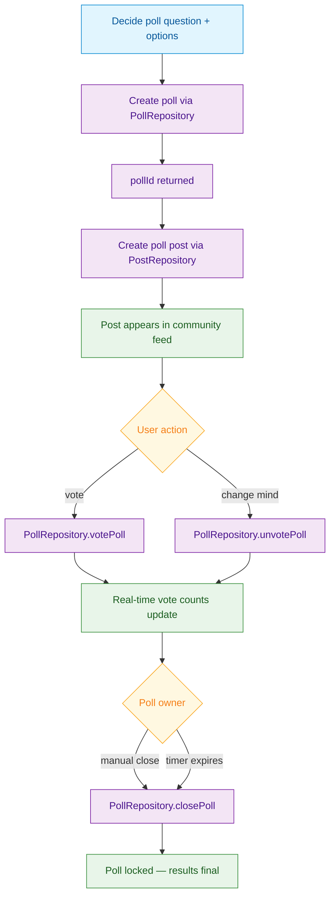

<Info>**SDK v7.x** · Last verified March 2026 · iOS · Android · Web · Flutter</Info>

<Accordion title="Speed run — just the code" icon="forward">
```typescript
// 1. Create a poll
const { data: poll } = await PollRepository.createPoll({
  question: 'Favorite color?', answerType: 'single',
  answers: [{ dataType: 'text', data: 'Red' }, { dataType: 'text', data: 'Blue' }],
});

// 2. Wrap it in a post
await PostRepository.createPollPost({
  pollId: poll.pollId, targetType: 'community', targetId: 'communityId',
});

// 3. Vote
await PollRepository.votePoll(poll.pollId, ['answerId-1']);

// 4. Close the poll
await PollRepository.closePoll(poll.pollId);
```
Full walkthrough below ↓
</Accordion>

Polls are one of the highest-engagement content types in social apps. social.plus provides a full poll lifecycle: create the poll, wrap it in a feed post, let users vote (and change their vote), and close or delete when done. All four platforms are supported — iOS, Android, TypeScript, and Flutter.



## What You'll Build

<CardGroup cols={4}>
  <Card title="Poll Creation" icon="square-poll-vertical">
    Create single or multiple-choice polls with up to 10 options and a custom expiry timer
  </Card>
  <Card title="Poll Posts" icon="pen-to-square">
    Wrap polls in community or user feed posts so they appear inline in any feed
  </Card>
  <Card title="Voting & Unvoting" icon="check-to-slot">
    Let users vote on one or more options and change their selection until the poll closes
  </Card>
  <Card title="Lifecycle Management" icon="rotate">
    Close polls early, delete them, and handle the closed state gracefully in your UI
  </Card>
</CardGroup>

<Info>
Polls are always published as part of a post — there are no standalone polls in the current SDK. The two-step flow (create poll → create post) is by design so polls appear in feeds like any other content.
</Info>

<Tip>
**Image polls**: Poll answers can include images instead of text — useful for "Which design do you prefer?" or "Which product looks better?" questions. Set `answer.dataType: 'image'` and provide a `fileId` (upload the image first) for each visual option. See [Poll Posts](/social-plus-sdk/social/content-management/posts/creation/poll-post) for the full answer object structure.
</Tip>

<Note>
**After completing this guide you'll have:**
- Poll creation embedded inside a feed post (single and multiple choice)
- Voting, vote-change, and poll-close flows implemented
- Vote counts updating in real-time in your feed
</Note>

---

## Quick Start: Create a Poll and Publish It

```typescript TypeScript
import { PollRepository, PostRepository } from '@amityco/ts-sdk';

// Step 1: Create the poll
const { data: poll } = await PollRepository.createPoll({
  question: 'What feature should we build next?',
  answerType: 'single',
  answers: [
    { dataType: 'text', data: 'Dark mode' },
    { dataType: 'text', data: 'Offline support' },
    { dataType: 'text', data: 'Video reactions' },
  ],
});

// Step 2: Publish as a community post
const { data: post } = await PostRepository.createPollPost({
  pollId: poll.pollId,
  text: 'Help us prioritise our roadmap! 👇',
  targetType: 'community',
  targetId: communityId,
});
```

Full reference → [Polls](/social-plus-sdk/core-concepts/content-handling/poll) · [Poll Posts](/social-plus-sdk/social/content-management/posts/creation/poll-post)

---

## Step-by-Step Implementation

<Steps>
  <Step title="Create the poll">
    Create the poll object first. Choose `'single'` for one answer or `'multiple'` for multi-select. Set `timeToClosePoll` in milliseconds — omit it for a poll that stays open until you manually close it.

    ```typescript TypeScript
    import { PollRepository } from '@amityco/ts-sdk';

    const { data: poll } = await PollRepository.createPoll({
      question: 'Which platform are you building on?',
      answerType: 'single',   // or 'multiple' for multi-select
      answers: [
        { dataType: 'text', data: 'iOS' },
        { dataType: 'text', data: 'Android' },
        { dataType: 'text', data: 'Web' },
        { dataType: 'text', data: 'Flutter' },
      ],
      // Optional: close automatically after 24 hours
      // timeToClosePoll: 24 * 60 * 60 * 1000,
    });

    const pollId = poll.pollId;
    ```

    Full reference → [Polls](/social-plus-sdk/core-concepts/content-handling/poll)
  </Step>
  <Step title="Publish as a post in a feed">
    Create a poll post with the `pollId`. Add context text as the post caption — this is what users see before expanding the poll.

    ```typescript TypeScript
    import { PostRepository } from '@amityco/ts-sdk';

    const { data: post } = await PostRepository.createPollPost({
      pollId,
      text: 'Tell us what you think! Results shared next week.',
      targetType: 'community',   // 'community' or 'user'
      targetId: communityId,
    });
    ```

    Full reference → [Poll Posts](/social-plus-sdk/social/content-management/posts/creation/poll-post)
  </Step>
  <Step title="Let users vote">
    Pass the poll ID and an array of answer IDs. For `single` polls, the array will have one item. For `multiple`, users can select up to all options.

    ```typescript TypeScript
    import { PollRepository } from '@amityco/ts-sdk';

    // Cast the vote
    const { data: updatedPoll } = await PollRepository.votePoll(
      poll.pollId,
      [selectedAnswerId]   // array of answer IDs
    );

    // Show updated vote counts immediately
    updatedPoll.answers.forEach(answer => {
      console.log(`${answer.data}: ${answer.voteCount} votes`);
    });
    ```

    Full reference → [Polls](/social-plus-sdk/core-concepts/content-handling/poll)
  </Step>
  <Step title="Allow users to change their vote">
    Users can unvote and re-vote as long as the poll is still open. Call `unvotePoll` first, then `votePoll` with the new selection.

    ```typescript TypeScript
    import { PollRepository } from '@amityco/ts-sdk';

    // Remove existing vote
    await PollRepository.unvotePoll(poll.pollId);

    // Cast a new vote
    await PollRepository.votePoll(poll.pollId, [newAnswerId]);
    ```

    Full reference → [Polls](/social-plus-sdk/core-concepts/content-handling/poll)
  </Step>
  <Step title="Close the poll manually">
    Poll owners and admins can close a poll early — for example, after a timed announcement. Once closed, no new votes are accepted and results are final.

    ```typescript TypeScript
    import { PollRepository } from '@amityco/ts-sdk';

    const { data: closedPoll } = await PollRepository.closePoll(poll.pollId);

    // closedPoll.isVotable === false — show results, hide vote button
    if (!closedPoll.isVotable) {
      showFinalResults(closedPoll);
    }
    ```

    Full reference → [Polls](/social-plus-sdk/core-concepts/content-handling/poll)
  </Step>
  <Step title="Delete a poll">
    Permanently removes the poll and all vote data. Only the poll creator or an admin can delete. The associated post should also be deleted separately.

    ```typescript TypeScript
    import { PollRepository } from '@amityco/ts-sdk';

    const isDeleted = await PollRepository.deletePoll(poll.pollId);
    ```

    Full reference → [Polls](/social-plus-sdk/core-concepts/content-handling/poll)
  </Step>
</Steps>

---

## Rendering Poll Results

Use the poll's `answers` array to render a visual results bar. Show current vote percentages while the poll is open, and pin the winner after it closes.

```typescript TypeScript
function renderPollResults(poll: Amity.Poll) {
  const totalVotes = poll.answers.reduce((sum, a) => sum + a.voteCount, 0);

  return poll.answers.map(answer => ({
    text: answer.data,
    votes: answer.voteCount,
    percentage: totalVotes > 0 ? Math.round((answer.voteCount / totalVotes) * 100) : 0,
    isSelected: answer.isVoted,   // true if current user voted for this option
  }));
}
```

---

## 🔗 Connect to Moderation & Analytics

<AccordionGroup>
  <Accordion title="Pin polls to community top" icon="thumbtack">
    Use the pin-post API to pin a poll post to the top of a community feed during active voting.

    → [Pin Post](/social-plus-sdk/social/content-management/posts/moderation/pin-post)
  </Accordion>
  <Accordion title="Flag polls" icon="flag">
    Poll posts can be flagged by users and reviewed in **Admin Console → Moderation → Flagged Content** like any other post type.
  </Accordion>
  <Accordion title="Webhook: poll post events" icon="webhook">
    Receive `post.created` and `post.updated` events for poll posts to trigger downstream actions like push notifications to community members when a new poll is published.

    → [Webhook Events](/analytics-and-moderation/social+-apis-and-services/webhook-event)
  </Accordion>
</AccordionGroup>

---

## Common Mistakes

<Warning>
**Creating a poll with fewer than 2 answers** — The API requires at least 2 answer options. Validate your form before calling `createPoll`.
</Warning>

<Warning>
**Forgetting to close polls** — Polls without a `closedAt` date stay open forever. If your poll is time-bound, either set `closedAt` at creation or call `closePoll` explicitly when the window ends.
</Warning>

<Warning>
**Displaying results before the user votes** — Showing percentages before voting biases choices. Hide results until the current user has voted or the poll is closed.
</Warning>

## Best Practices

<AccordionGroup>
  <Accordion title="Poll design" icon="square-poll-vertical">
    - Keep questions under 100 characters — readable at a glance in a feed card
    - Provide 2–5 options for most polls; more than 6 reduces completion rates
    - Avoid vague options like "Option A" — every answer should be self-explanatory without reading the question
    - Use `'multiple'` answer type for taste/preference questions, `'single'` for factual or decision polls
  </Accordion>
  <Accordion title="Rendering closed polls" icon="lock">
    - Check `poll.isVotable` before showing the vote button — hide it entirely when `false`
    - Highlight the winning option (most votes) with a distinct visual treatment after close
    - Show the total vote count prominently — social proof drives engagement on future polls
    - Keep the poll post visible in the feed after closing; don't delete it just because voting has ended
  </Accordion>
  <Accordion title="Real-time result updates" icon="bolt">
    - Subscribe to the post live object to receive vote count updates without manual refresh
    - Animate the percentage bar as it changes — a smooth transition feels more alive than a jump
    - Debounce vote button presses to prevent accidental double-votes
  </Accordion>
</AccordionGroup>

---

## Next Steps

<Card
  title="Your next step → Comments & Reactions"
  icon="arrow-right"
  href="/use-cases/social/comments-and-reactions"
>
  Polls are interactive — now add comments and reactions so users can discuss the results.
</Card>

Or explore related guides:

<CardGroup cols={3}>
  <Card title="Rich Content Creation" href="/use-cases/social/rich-content-creation" icon="pen-to-square">
    Polls alongside all other post types in one guide
  </Card>
  <Card title="Community Platform" href="/use-cases/social/community-platform" icon="users">
    Publish polls to community feeds with pinning support
  </Card>
  <Card title="Notifications & Engagement" href="/use-cases/social/notifications-and-engagement" icon="bell">
    Notify members when a new poll is published
  </Card>
</CardGroup>
