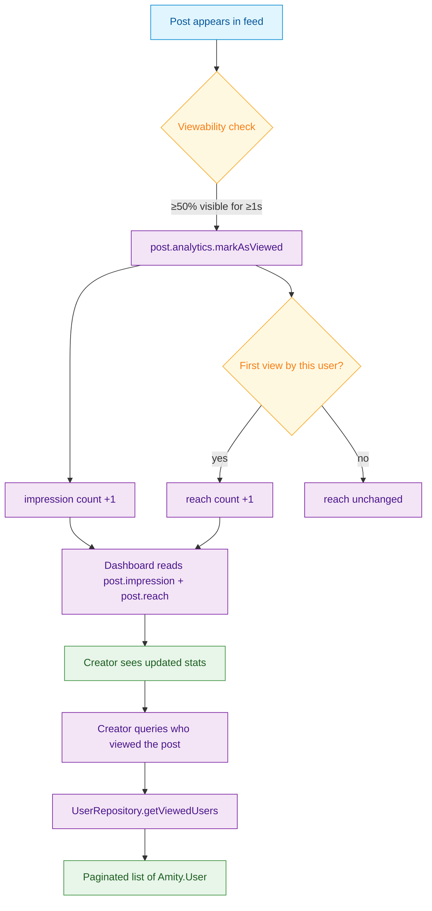

<Info>**SDK v7.x** · Last verified March 2026 · iOS · Android · Web · Flutter</Info>

<Accordion title="Speed run — just the code" icon="forward">
```typescript
// 1. Mark a post as viewed (impression + reach)
await post.analytics.markAsViewed();

// 2. Read impression & reach counters
const { impressionsCount, reachCount } = post.analytics;

// 3. Query who viewed the post
const viewers = await post.analytics.getReachUsers({ limit: 50 });
```
Full walkthrough below ↓
</Accordion>

<Tip>
**Platform note** — code samples below use TypeScript. Every method has an equivalent in the iOS (Swift), Android (Kotlin), and Flutter (Dart) SDKs — see the linked SDK reference in each step.
</Tip>

social.plus tracks two key content performance metrics for every post:

- **Impressions** — total number of times the post was viewed (same user can contribute multiple impressions)
- **Reach** — number of *unique* users who viewed the post

Both are updated in near-real time. This guide shows you how to record impressions as users scroll a feed, read the counters, and query the list of users who reached a post — the building blocks for a creator analytics dashboard.



<Note>
**After completing this guide you'll have:**
- Post impression tracking firing on every feed scroll event
- Unique reach (`impression`) and total views (`markAsViewed`) both captured
- A "Who viewed this" list queryable per post for creator dashboards
</Note>

---

## Quick Start: Record a View and Read the Counters

```typescript TypeScript
import { PostRepository } from '@amityco/ts-sdk';

// Called from your IntersectionObserver when a post is ≥50% visible
function onPostVisible(post: Amity.Post) {
  post.analytics.markAsViewed();
  console.log(`Impressions: ${post.impression} · Reach: ${post.reach}`);
}
```

Full reference → [Post Impressions](/social-plus-sdk/social/content-management/posts/analytics/post-impressions)

---

## Step-by-Step Implementation

<Steps>
  <Step title="Record impressions as posts scroll into view">
    Call `markAsViewed()` when a post becomes meaningfully visible. In web apps, use an `IntersectionObserver`; in native apps, use your list's viewability callbacks. Aim for a threshold of ≥50% visible for at least 1 second to avoid counting rapid scroll-past views.

    ```typescript TypeScript
    import { PostRepository } from '@amityco/ts-sdk';

    // Subscribe to the feed so we have live post objects
    const unsubscribe = PostRepository.getPosts(
      { targetType: 'community', targetId: communityId },
      ({ data: posts }) => {
        posts.forEach(post => trackVisibility(post));
      },
    );

    function trackVisibility(post: Amity.Post) {
      const observer = new IntersectionObserver(
        (entries) => {
          entries.forEach(entry => {
            if (entry.isIntersecting) {
              post.analytics.markAsViewed();
              observer.disconnect();   // count each scroll-into-view once per session
            }
          });
        },
        { threshold: 0.5 }
      );
      observer.observe(document.getElementById(post.postId)!);
    }
    ```

    Full reference → [Post Impressions](/social-plus-sdk/social/content-management/posts/analytics/post-impressions)
  </Step>
  <Step title="Display impression and reach counts">
    Read `post.impression` and `post.reach` from the live post object. Both update in near-real time as views come in.

    ```typescript TypeScript
    import { PostRepository } from '@amityco/ts-sdk';

    // Subscribe to a single post for live counter updates
    const unsubscribe = PostRepository.getPost(postId, ({ data: post }) => {
      updateDashboard({
        impressions: post.impression,
        reach: post.reach,
      });
    });
    ```

    Full reference → [Post Impressions](/social-plus-sdk/social/content-management/posts/analytics/post-impressions)
  </Step>
  <Step title="Query the list of users who viewed a post">
    Get a paginated list of every unique user who reached a post — useful for "Seen by" UI, audience profiling, and creator insights.

    ```typescript TypeScript
    import { UserRepository } from '@amityco/ts-sdk';

    const unsubscribe = UserRepository.getViewedUsers(
      { postId: post.postId, limit: 20 },
      ({ data: users, hasNextPage, onNextPage, loading, error }) => {
        if (loading) return;
        if (error) console.error(error);

        renderViewedByList(users);

        if (hasNextPage) {
          loadMoreButton.onclick = onNextPage;
        }
      },
    );
    ```

    Full reference → [Post Impressions](/social-plus-sdk/social/content-management/posts/analytics/post-impressions)
  </Step>
  <Step title="Build a creator dashboard card">
    Combine impressions, reach, reaction count, and comment count into a compact analytics card shown on the creator's post detail view.

    ```typescript TypeScript
    import { PostRepository } from '@amityco/ts-sdk';

    const unsubscribe = PostRepository.getPost(postId, ({ data: post }) => {
      const stats = {
        impressions: post.impression,
        reach: post.reach,
        reactions: post.reactionsCount,      // total reactions across all types
        comments: post.commentsCount,
        // engagement rate: (reactions + comments) / reach * 100
        engagementRate: post.reach > 0
          ? ((post.reactionsCount + post.commentsCount) / post.reach * 100).toFixed(1)
          : '0',
      };

      renderCreatorStats(stats);
    });
    ```
  </Step>
</Steps>

---

## Analytics Metrics Reference

| Metric | Where to read | What it means |
|---|---|---|
| `post.impression` | Post live object | Total views (one user can generate multiple) |
| `post.reach` | Post live object | Unique users who viewed the post |
| `post.reactionsCount` | Post live object | Total reactions across all reaction types |
| `post.commentsCount` | Post live object | Total comments including replies |
| Viewed users list | `UserRepository.getViewedUsers` | Paginated list of `Amity.User` objects |

---

## Connect to Moderation & Analytics

<Frame caption="Admin Console — Post analytics dashboard showing impressions, reach, and engagement metrics">
  
</Frame>

<AccordionGroup>
  <Accordion title="Analytics Console" icon="chart-bar">
    Impression and reach data aggregates across all posts and is visible in **Admin Console → Analytics → Content**. Filter by community, date range, or content type to spot high-performing content.
  </Accordion>
  <Accordion title="Story impressions" icon="circle-play">
    Stories have their own impression tracking via the Story SDK — the same impression/reach concept applies.

    → [Stories & Ephemeral Content](/use-cases/social/stories-and-ephemeral-content)
  </Accordion>
  <Accordion title="Webhook: content performance" icon="webhook">
    Although there's no real-time webhook per impression, you can combine `post.created` and `post.updated` webhooks with your own analytics pipeline to build server-side engagement scoring.

    → [Webhook Events](/analytics-and-moderation/social+-apis-and-services/webhook-event)
  </Accordion>
</AccordionGroup>

---

## Common Mistakes

<Warning>
**Calling `markAsViewed()` on every re-render** — React and Flutter components can re-render dozens of times. Debounce the call or use an Intersection Observer to fire it only when the post enters the viewport for the first time.

```typescript
// ❌ Bad — fires on every render
useEffect(() => { post.analytics.markAsViewed(); });

// ✅ Good — fire once with Intersection Observer
const observer = new IntersectionObserver(([entry]) => {
  if (entry.isIntersecting) {
    post.analytics.markAsViewed();
    observer.disconnect();
  }
});
```
</Warning>

<Warning>
**Confusing impressions with reach** — Impressions count total views (one user can contribute many). Reach counts unique viewers. Display the right metric for the right context.
</Warning>

<Warning>
**Building analytics dashboards without caching** — Fetching reach user lists on every refresh is expensive. Cache the data for at least 30 seconds and show loading states for fresh queries.
</Warning>

## Best Practices

<AccordionGroup>
  <Accordion title="When to call markAsViewed" icon="eye">
    - **Feed scroll**: fire when ≥50% of the post card is visible for ≥1 second
    - **Post detail view**: fire immediately on open — the user navigated intentionally
    - **Clip reel**: fire when the clip starts playing (it's clearly in focus)
    - **Don't fire** on posts that are briefly visible during a fast scroll-to-top gesture
  </Accordion>
  <Accordion title="Non-blocking analytics" icon="bolt">
    - `markAsViewed()` is a fire-and-forget call — never `await` it in a render path
    - If it fails due to network conditions, don't retry in the same session; impressions are best-effort
    - Impression accuracy is near-real time; don't expect sub-second updates in the dashboard
  </Accordion>
  <Accordion title="Privacy and transparency" icon="shield">
    - If your app shows creators a "Seen by" list, disclose this to viewers in your privacy policy
    - The `getViewedUsers` API returns user objects — only show identifiable information (name, avatar) where appropriate for your app's context
    - Respect user block relationships: don't show a blocked user's name to a creator in the viewed list
  </Accordion>
  <Accordion title="Dashboard design" icon="chart-line">
    - Lead with **reach** (unique viewers) as the headline metric — it's more meaningful than raw impressions for most creators
    - Show a 7-day or 28-day trend line, not just the current snapshot
    - Display engagement rate (reactions + comments / reach) to help creators judge content quality
    - For communities with many posts, sort by reach descending to surface top-performing content first
  </Accordion>
</AccordionGroup>

---

<Tip>
**Dive deeper**: [Posts API Reference](/social-plus-sdk/social/content-management/posts/overview) has full parameter tables, method signatures, and platform-specific details for every API used in this guide.
</Tip>

## Next Steps

<Card
  title="Your next step → Advertising & Monetization"
  icon="arrow-right"
  href="/use-cases/social/advertising-and-monetization"
>
  You're tracking views — now monetize that attention with native ads in the feed.
</Card>

Or explore related guides:

<CardGroup cols={3}>
  <Card title="Short-Form Video Clips" href="/use-cases/social/short-form-video-clips" icon="film">
    Track impressions on clip posts as users scroll a vertical reel
  </Card>
  <Card title="Stories & Ephemeral Content" href="/use-cases/social/stories-and-ephemeral-content" icon="circle-play">
    Story-specific impression and reach analytics
  </Card>
  <Card title="Build a Social Feed" href="/use-cases/social/build-a-social-feed" icon="rectangle-list">
    The feed query that powers impression tracking at scale
  </Card>
</CardGroup>
