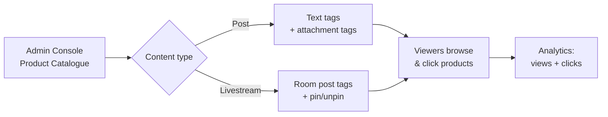

<Info>**SDK v7.x** · Last verified March 2026 · iOS · Android · Web</Info>

<Accordion title="Speed run — just the code" icon="forward">
```typescript
import { PostRepository } from '@amityco/ts-sdk';

// 1. Text post with product tags
const textPost = await PostRepository.createPost({
    targetType: 'community',
    targetId: communityId,
    dataType: 'text',
    data: { text: 'Loving this Nike Air Max for my morning runs!' },
    productTags: [
        { productId: 'prod_001', text: 'Nike Air Max', index: 12, length: 12 },
    ],
});

// 2. Image post with attachment product tags
const imagePost = await PostRepository.createPost({
    targetType: 'community',
    targetId: communityId,
    dataType: 'image',
    data: { text: 'Check out these products!' },
    attachments: [
        { fileId: 'image-file-id-1', type: 'image' },
        { fileId: 'image-file-id-2', type: 'image' },
    ],
    attachmentProductTags: {
        'image-file-id-1': [{ productId: 'prod_001' }],
        'image-file-id-2': [{ productId: 'prod_002' }],
    },
});

// 3. Track engagement
product.analytics.markAsViewed('feed_page/product_list/product_item', 'post', postId);
product.analytics.markAsClicked('feed_page/product_list/product_item', 'post', postId);
```
Full walkthrough below ↓
</Accordion>

<Tip>
**Platform note** — code samples below use TypeScript. Every method has an equivalent in the iOS (Swift) and Android (Kotlin) SDKs — see the linked SDK reference in each section.
</Tip>

<Frame caption="Tag products in a post by typing @ and switching to the product tab">
  
</Frame>

Product tagging lets users attach products from your catalogue to posts and livestreams, turning social content into a shoppable storefront. Viewers see product cards with images, prices, and direct links — without leaving the feed or stream.



## Where Product Tagging Works

| Content type | Tag mechanism | Max tags | Pinning | Platforms |
|-------------|--------------|---------|---------|-----------|
| **Text post** | `productTags` — reference product by position in text | 20 | — | iOS, Android, Web |
| **Image post** | `attachmentProductTags` — link products to specific images by `fileId` | 20 | — | iOS, Android, Web |
| **Video post** | `attachmentProductTags` — link products to specific videos by `fileId` | 20 | — | iOS, Android, Web |
| **Livestream** | `productTags` + `pinnedProductId` on room post | 20 | 1 at a time | iOS, Android, Web |

<Note>
Flutter and React Native do not yet support product tagging.
</Note>

---

## Step 0: Set Up Your Product Catalogue

Before any tagging can happen, products must exist in **Admin Console → Product catalogue**.

<Steps>
  <Step title="Open the Product Catalogue">
    Navigate to **Product catalogue** in the Admin Console sidebar.

    <Frame caption="Product Catalogue dashboard — search, filter, import, and manage your product database">
      
    </Frame>
  </Step>
  <Step title="Add products individually or in bulk">
    Click **+ Add product** to create one product at a time, or use **Import** to upload a CSV for bulk creation. Each product needs:
    - **Product ID** — unique identifier (cannot change after creation)
    - **Product Name** — display name shown when tagged
    - **Product URL** — link for viewers to click through
    - **Status** — must be **Active** to appear in tag search

    <Frame caption="Add product form — fill in ID, name, URL, price, and upload a thumbnail">
      
    </Frame>
  </Step>
  <Step title="Verify Active status">
    Only **Active** products are discoverable in the tag-product search. Set seasonal or discontinued products to **Archived** to hide them without deleting.
  </Step>
</Steps>

<Tip>
Full Admin Console guide → [Product Catalogue](/analytics-and-moderation/console/product-management/overview)
</Tip>

---

## Tag Products in Posts

### UIKit (recommended)

The post composer includes built-in product tagging — type `@` and switch to the product tab:

<CardGroup cols={2}>
  <Card title="Tag products while composing" icon="at">
    <Frame>
      
    </Frame>
  </Card>
  <Card title="Tagged products displayed below the post" icon="tag">
    <Frame>
      
    </Frame>
  </Card>
</CardGroup>

UIKit components used:

| Component | Role |
|-----------|------|
| `ProductTagSelectionComponent` | Search and multi-select products (mode: `create`, `edit`, or `livestream`) |
| `ProductTagListComponent` | Read-only list below the post (mode: `post`, `image`, `video`, `livestream`) |

<Tip>
Component reference → [Product Tagging Components](/uikit/components/social/product-tagging)
</Tip>

### SDK: Text Post with Product Tags

Tag products inline within the text. Each tag references a product by ID and a position range in the text.

```typescript
const post = await PostRepository.createPost({
    targetType: 'community',
    targetId: communityId,
    dataType: 'text',
    data: { text: 'Loving this Nike Air Max for my morning runs!' },
    productTags: [
        { productId: 'prod_001', text: 'Nike Air Max', index: 12, length: 12 },
    ],
});
```

### SDK: Image Post with Attachment Product Tags

For image (and video) posts, attach products to specific media files using `attachmentProductTags`. Products are linked by the `fileId` of each uploaded image.

```typescript
const post = await PostRepository.createPost({
    targetType: 'community',
    targetId: communityId,
    dataType: 'image',
    data: { text: 'Check out these products!' },
    attachments: [
        { fileId: 'image-file-id-1', type: 'image' },
        { fileId: 'image-file-id-2', type: 'image' },
    ],
    attachmentProductTags: {
        'image-file-id-1': [{ productId: 'prod_001' }],
        'image-file-id-2': [{ productId: 'prod_002' }],
    },
});
```

SDK reference → [Text Posts](/social-plus-sdk/social/content-management/posts/creation/text-post) · [Image Posts](/social-plus-sdk/social/content-management/posts/creation/image-post) · [Video Posts](/social-plus-sdk/social/content-management/posts/creation/video-post)

---

## Tag Products in Livestreams

Livestream product tagging adds **pinning** — the host (or authorized co-host) can pin one product at a time as a prominent overlay visible to all viewers.

<CardGroup cols={2}>
  <Card title="Host view — pinned product overlay" icon="tower-broadcast">
    <Frame>
      
    </Frame>
  </Card>
  <Card title="Viewer view — scrollable product list" icon="list">
    <Frame>
      
    </Frame>
  </Card>
</CardGroup>

### Key differences from post tagging

| Capability | Posts | Livestreams |
|-----------|-------|-------------|
| Pin a product as overlay | — | ✅ (1 at a time, auto-replaces) |
| Swap pin mid-session | — | ✅ |
| Co-host product permissions | — | ✅ (host grants per co-host) |
| Update tags after creation | ✅ | ✅ (full replacement) |
| Viewer click-through | ✅ | ✅ (in-app browser, stream continues) |

<Tip>
Full livestream product tagging walkthrough → [Livestream: Product Tagging](/use-cases/social/livestream/product-tagging)
</Tip>

### Manage tagged products during the stream

<Frame caption="Host management view — pin, unpin, remove, and add products">
  
</Frame>

---

## Track Product Engagement

Both post and livestream product tags support fire-and-forget analytics for views and clicks. Events are automatically deduplicated per product per source.

```typescript
// When a product card enters the viewport
product.analytics.markAsViewed(
  'feed_page/product_list/product_item',   // location
  AnalyticsSourceTypeEnum.POST,             // or ROOM for livestreams
  postId,                                   // source ID
);

// When a viewer taps the product link
product.analytics.markAsClicked(
  'feed_page/product_list/product_item',
  AnalyticsSourceTypeEnum.POST,
  postId,
);
```

| Event | Deduplication key | Notes |
|-------|------------------|-------|
| `markAsViewed` | `{productId}.view.{sourceType}.{sourceId}` | Same product in different posts = separate events |
| `markAsClicked` | `{productId}.linkClicked.{sourceType}.{sourceId}` | Fire before opening the product URL |

### Admin Console: Review product performance

Tagged posts surface in the console with linked product cards — admins can see which products are referenced and filter posts by tag.

<Frame caption="Posts with product tags visible in the Admin Console post list">
  
</Frame>

---

## Posts vs. Livestreams: Choosing the Right Approach

<AccordionGroup>
  <Accordion title="Shoppable feed (posts)" icon="newspaper">
    **Best for**: Product reviews, influencer recommendations, curated collections, community marketplaces.

    - Tag products in text, image, or video posts
    - Products appear as a "Products tagged in this post" section below the content
    - Viewers browse and click through at their own pace
    - No real-time coordination required
  </Accordion>
  <Accordion title="Live commerce (livestreams)" icon="tower-broadcast">
    **Best for**: Flash sales, product demos, Q&A sessions, unboxing events.

    - Pin one product at a time as a prominent overlay
    - Swap pins mid-stream to match what the host is discussing
    - Co-hosts can manage products if the host grants permission
    - Pair with live chat for real-time questions about the product
  </Accordion>
  <Accordion title="Hybrid: post-stream replay" icon="rotate">
    **Best for**: Maximizing content lifespan.

    - After a livestream ends, the post remains in the feed with all tagged products still browsable
    - Viewers who missed the live event can still shop the product list
    - Pin overlay is removed in replay, but the product list persists
  </Accordion>
</AccordionGroup>

---

## Common Mistakes

<Warning>
**Tagging an Archived product** — Only products with **Active** status in the Admin Console appear in the tag-product search. If a host can't find a product, check its status.
</Warning>

<Warning>
**Confusing text tags vs. attachment tags** — Text posts use `productTags` (position in text). Image and video posts use `attachmentProductTags` (keyed by `fileId`). Mixing them up causes silent failures.
</Warning>

<Warning>
**Using the parent post ID for livestream pin/unpin** — `pinProduct` and `unpinProduct` require the **child** room post ID, not the parent. See [Livestream Product Tagging](/use-cases/social/livestream/product-tagging) for details.
</Warning>

## Best Practices

<AccordionGroup>
  <Accordion title="Catalogue management" icon="database">
    - Use CSV import for initial catalogue setup with many products
    - Use consistent Product IDs (e.g., `SKU-001`) — they're immutable after creation
    - Archive seasonal products instead of deleting to preserve tag history
    - Keep thumbnails at 1:1 aspect ratio for consistent display
  </Accordion>
  <Accordion title="Tagging strategy" icon="bullseye">
    - Tag 3–5 products per post for best engagement — too many dilutes focus
    - For livestreams, pre-tag all products before going live so they're ready immediately
    - In image posts, link each product to the specific image that shows it
    - Use text tags for editorial posts, attachment tags for visual-first content
  </Accordion>
  <Accordion title="Analytics & optimization" icon="chart-line">
    - Call `markAsViewed` when the product card enters the viewport (use intersection observer on Web)
    - Call `markAsClicked` on tap before opening the URL
    - Review view-to-click ratios in the Admin Console to optimize product placement
    - A/B test text tags vs. attachment tags to see which drives more clicks
  </Accordion>
</AccordionGroup>

---

## Related Topics

<CardGroup cols={3}>
  <Card title="Livestream Product Tagging" href="/use-cases/social/livestream/product-tagging" icon="tags">
    Deep-dive: pin/unpin, co-host permissions, and per-stream analytics.
  </Card>
  <Card title="Rich Content Creation" href="/use-cases/social/rich-content-creation" icon="pen-to-square">
    Text, image, video, poll, and file posts with @mentions and hashtags.
  </Card>
  <Card title="Product Catalogue (Console)" href="/analytics-and-moderation/console/product-management/overview" icon="store">
    Admin guide for uploading, importing, and managing your product database.
  </Card>
</CardGroup>

<CardGroup cols={3}>
  <Card title="UIKit Components" href="/uikit/components/social/product-tagging" icon="palette">
    ProductTagSelectionComponent, ProductTagListComponent, and ManageProductTagListComponent.
  </Card>
  <Card title="Text Post SDK" href="/social-plus-sdk/social/content-management/posts/creation/text-post" icon="text">
    productTags parameter reference for text posts.
  </Card>
  <Card title="Video SDK Product Tagging" href="/social-plus-sdk/video-new/broadcasting/product-tagging" icon="video">
    Room post creation, pinProduct, unpinProduct, and co-host permissions.
  </Card>
</CardGroup>
