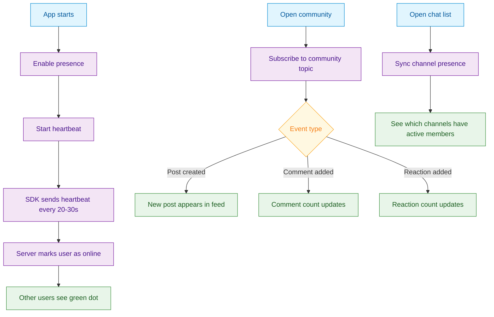

<Info>**SDK v7.x** · Last verified March 2026 · iOS · Android · Web · Flutter</Info>

<Accordion title="Speed run — just the code" icon="forward">
```typescript
// 1. Enable presence for the current user
await PresenceManager.enable();

// 2. Start heartbeat to stay online
PresenceManager.startHeartbeat({ intervalMs: 10000 });

// 3. Observe a channel's online members
ChannelRepository.Membership.getMembers(
  { channelId: 'ch-123', filter: 'online' },
  ({ data }) => { renderOnlineUsers(data); }
);

// 4. Subscribe to real-time topic events
Client.on('post.created', (event) => {
  showNewPostIndicator(event.data);
});
```
Full walkthrough below ↓
</Accordion>

Presence makes your app feel alive. When users can see who's online, which communities are active, and get instant content updates, engagement increases. This guide covers enabling user presence, syncing channel activity, managing heartbeats, and subscribing to real-time social events.



## What You'll Build

<CardGroup cols={4}>
  <Card title="User Presence" icon="circle" iconColor="#22c55e">
    Show online/offline status with green dots, "last seen" timestamps, and online user counts
  </Card>
  <Card title="Channel Presence" icon="hashtag">
    Track which channels and communities have active members right now
  </Card>
  <Card title="Heartbeat Sync" icon="heart-pulse">
    Automatic heartbeat that keeps the user's online status current across app lifecycle changes
  </Card>
  <Card title="Real-time Event Subscriptions" icon="bolt">
    Subscribe to live updates for communities, posts, comments, and user activity
  </Card>
</CardGroup>

<Info>
**Prerequisites**: SDK installed and authenticated → [SDK Setup](/social-plus-sdk/getting-started/overview). Presence features must be enabled for your network — check **Admin Console → Settings**.
</Info>

<Note>
**After completing this guide you'll have:**
- Online/offline presence indicators on user avatars throughout the app
- Channel-level presence (who is currently viewing a community or room)
- Real-time event subscriptions for platform-wide activity tracking
</Note>

---

## Quick Start: Enable User Presence

```typescript TypeScript
import { PresenceManager, UserPresenceRepository } from '@social-plus/sdk';

const presence = new PresenceManager();
await presence.enable();
presence.startHeartbeat();

// Track another user's online status
const userPresence = new UserPresenceRepository();
await userPresence.syncUserPresence('user-123');
```

Full reference → [Presence Overview](/social-plus-sdk/core-concepts/realtime-communication/presence-state/overview)

---

## Part 1: User Presence (Online/Offline)

<Steps>
  <Step title="Enable presence and start heartbeat">
    Enable presence tracking for the current user and start the automatic heartbeat. The SDK sends a heartbeat every 20-30 seconds to keep the user's online status current.

    ```typescript TypeScript
    import { PresenceManager } from '@social-plus/sdk';

    const presence = new PresenceManager();

    const isAvailable = await presence.isEnabled();
    if (isAvailable) {
      await presence.enable();
      presence.startHeartbeat();
    }
    ```

    Full reference → [Heartbeat Sync](/social-plus-sdk/core-concepts/realtime-communication/presence-state/heartbeat-sync)
  </Step>
  <Step title="Query user presence">
    Check whether specific users are online. Query up to 220 users at once for a member list or chat contact screen.

    ```typescript TypeScript
    import { UserPresenceRepository } from '@social-plus/sdk';

    const presenceRepo = new UserPresenceRepository();
    const presences = await presenceRepo.getUserPresence(['user-1', 'user-2', 'user-3']);

    presences.forEach(p => {
      console.log(`${p.userId}: ${p.isOnline ? 'Online' : 'Offline'}`);
    });
    ```

    Full reference → [User Presence](/social-plus-sdk/core-concepts/realtime-communication/presence-state/user-presence)
  </Step>
  <Step title="Sync presence for real-time updates">
    For users visible on screen (profile page, chat list), sync their presence to get live updates when they come online or go offline. Max 20 synced users at a time.

    ```typescript TypeScript
    const presenceRepo = new UserPresenceRepository();

    // Start syncing (call for each visible user)
    await presenceRepo.syncUserPresence('user-123');

    // Observe changes
    presenceRepo.getSyncingUserPresence().subscribe(presences => {
      presences.forEach(p => {
        updateStatusDot(p.userId, p.isOnline);
      });
    });

    // Stop when user scrolls off screen
    await presenceRepo.unsyncUserPresence('user-123');
    ```

    Full reference → [User Presence](/social-plus-sdk/core-concepts/realtime-communication/presence-state/user-presence)
  </Step>
  <Step title="Get online users count">
    Display a global "X users online" counter for your platform.

    ```typescript TypeScript
    const presenceRepo = new UserPresenceRepository();
    const count = await presenceRepo.getOnlineUsersCount();
    console.log(`${count} users online`);
    ```

    Full reference → [User Presence](/social-plus-sdk/core-concepts/realtime-communication/presence-state/user-presence)
  </Step>
  <Step title="Handle app lifecycle">
    Stop the heartbeat when the app goes to the background and restart it when the app returns to the foreground. This prevents false "online" status while the app is minimized.

    ```typescript TypeScript
    // Web: use visibility change
    document.addEventListener('visibilitychange', () => {
      if (document.hidden) {
        presence.stopHeartbeat();
      } else {
        presence.startHeartbeat();
      }
    });
    ```

    Full reference → [Heartbeat Sync](/social-plus-sdk/core-concepts/realtime-communication/presence-state/heartbeat-sync)
  </Step>
</Steps>

---

## Part 2: Channel Presence

<Steps>
  <Step title="Sync channel presence">
    Track which channels have active members. Useful for chat lists showing "2 members active" or highlighting active communities.

    ```typescript TypeScript
    import { ChannelPresenceRepository } from '@social-plus/sdk';

    const channelPresence = new ChannelPresenceRepository();
    await channelPresence.syncChannelPresence('channel-123');

    channelPresence.getSyncingChannelPresence().subscribe(updates => {
      updates.forEach(cp => {
        console.log(`Channel ${cp.channelId}: ${cp.activeUserCount} active`);
      });
    });
    ```

    Full reference → [Channel Presence](/social-plus-sdk/core-concepts/realtime-communication/presence-state/channel-presence)
  </Step>
  <Step title="Manage visible channels">
    Sync/unsync channels as the user scrolls through a chat list. Max 20 synced channels at a time.

    ```typescript TypeScript
    // When a new channel becomes visible
    await channelPresence.syncChannelPresence('channel-456');

    // When a channel scrolls off screen
    await channelPresence.unsyncChannelPresence('channel-123');

    // Cleanup on unmount
    await channelPresence.unsyncAllChannelPresence();
    ```

    Full reference → [Channel Presence](/social-plus-sdk/core-concepts/realtime-communication/presence-state/channel-presence)
  </Step>
</Steps>

---

## Part 3: Real-time Social Event Subscriptions

Beyond presence, you can subscribe to content events — new posts, comments, reactions — so your UI updates instantly without polling.

<Steps>
  <Step title="Subscribe to community events">
    Subscribe at different granularity levels: community-level, post-level, or comment-level.

    ```typescript TypeScript
    import { getCommunityTopic, SubscriptionLevels } from '@amityco/ts-sdk';

    // Subscribe to all post events in a community
    const topic = getCommunityTopic(community, SubscriptionLevels.POST);

    // Subscribe to posts AND comments
    const fullTopic = getCommunityTopic(community, SubscriptionLevels.POST_AND_COMMENT);
    ```

    Full reference → [Social Real-time Events](/social-plus-sdk/core-concepts/realtime-communication/realtime-events/social-realtime-events)
  </Step>
  <Step title="Subscribe to post and comment events">
    For a post detail screen, subscribe to comment-level events on a specific post.

    ```typescript TypeScript
    import { getPostTopic, getCommentTopic, SubscriptionLevels } from '@amityco/ts-sdk';

    // Subscribe to comment events on a post
    const postCommentTopic = getPostTopic(post, SubscriptionLevels.COMMENT);

    // Subscribe to a specific comment's events
    const commentTopic = getCommentTopic(comment);
    ```

    Full reference → [Social Real-time Events](/social-plus-sdk/core-concepts/realtime-communication/realtime-events/social-realtime-events)
  </Step>
  <Step title="Subscribe to follow events">
    Get real-time updates when someone follows or unfollows the current user.

    ```typescript TypeScript
    import { getMyFollowersTopic, getMyFollowingsTopic } from '@amityco/ts-sdk';

    const myFollowers = getMyFollowersTopic();
    const myFollowings = getMyFollowingsTopic();
    ```

    Full reference → [Social Real-time Events](/social-plus-sdk/core-concepts/realtime-communication/realtime-events/social-realtime-events)
  </Step>
</Steps>

---

## 🔗 Connect to Moderation & Analytics

<AccordionGroup>
  <Accordion title="Presence analytics" icon="chart-bar">
    Track daily active concurrent users and peak online times in **Admin Console → Analytics Dashboard**. This helps with capacity planning and understanding peak engagement windows.
  </Accordion>
  <Accordion title="Admin Console: presence settings" icon="gear">
    Enable or disable presence features for your network in **Admin Console → Settings**. Presence can be toggled per-network without code changes.
  </Accordion>
  <Accordion title="Webhook: real-time event triggers" icon="webhook">
    Combine SDK real-time events with webhook events for server-side workflows. For example, subscribe to `post.created` in the SDK for instant UI updates, and also handle it via webhook for server-side indexing.

    → [Webhook Events](/analytics-and-moderation/social+-apis-and-services/webhook-event)
  </Accordion>
</AccordionGroup>

---

## Common Mistakes

<Warning>
**Forgetting to stop the heartbeat on logout** — If you start `PresenceManager.startHeartbeat()` but don't stop it when the user logs out, the user appears "online" indefinitely.

```typescript
// ❌ Bad — heartbeat leaks
async function logout() {
  await Client.logout(); // heartbeat still running
}

// ✅ Good — stop heartbeat first
async function logout() {
  PresenceManager.stopHeartbeat();
  await Client.logout();
}
```
</Warning>

<Warning>
**Setting the heartbeat interval too low** — Intervals under 5 seconds waste bandwidth and may trigger rate limits. The recommended minimum is 10 seconds.
</Warning>

<Warning>
**Subscribing to too many topics at once** — Each topic subscription maintains a WebSocket channel. Subscribe only to topics visible on screen and unsubscribe when the user navigates away.
</Warning>

## Best Practices

<AccordionGroup>
  <Accordion title="Presence UX" icon="circle">
    - Use a green dot for "online", grey dot for "offline", and show "Last seen X min ago" for recently active users
    - Don't show exact "last seen" timestamps for privacy — round to "a few minutes ago", "an hour ago", etc.
    - Let users opt out of showing their online status in profile settings
    - Combine presence with typing indicators in chat for a "User is typing..." experience
  </Accordion>
  <Accordion title="Performance" icon="gauge">
    - Respect the 20-user sync limit — sync only users currently visible on screen
    - Unsync users/channels as they scroll off screen; re-sync when they scroll back
    - Use `getUserPresence()` for one-time queries (member lists); use `syncUserPresence()` only for screens that need live updates
    - Stop heartbeat in background to avoid battery drain on mobile
    - Use `viewId` when the same user is displayed in multiple UI components to avoid duplicate unsubscriptions
  </Accordion>
  <Accordion title="Real-time event subscriptions" icon="bolt">
    - Subscribe at the highest useful level: one `getCommunityTopic(community, POST_AND_COMMENT)` subscription is better than separate post + comment subscriptions
    - Unsubscribe when the component/screen unmounts — don't leak subscriptions
    - Use real-time events for UI updates; use webhooks for server-side workflows
    - Don't subscribe to everything globally — only subscribe to topics the user is actively viewing
  </Accordion>
</AccordionGroup>

---

## Next Steps

<Card
  title="Your next step → Notifications & Engagement"
  icon="arrow-right"
  href="/use-cases/social/notifications-and-engagement"
>
  Presence is live — now pair it with push notifications to keep users informed across sessions.
</Card>

Or explore related guides:

<CardGroup cols={3}>
  <Card title="Build a Social Feed" href="/use-cases/social/build-a-social-feed" icon="rectangle-list">
    Use Live Collections for real-time feed updates
  </Card>
  <Card title="Notifications & Engagement" href="/use-cases/social/notifications-and-engagement" icon="bell">
    Combine presence with notification delivery
  </Card>
  <Card title="User Profiles & Social Graph" href="/use-cases/social/user-profiles-and-social-graph" icon="user-group">
    Show online status on user profiles
  </Card>
</CardGroup>
