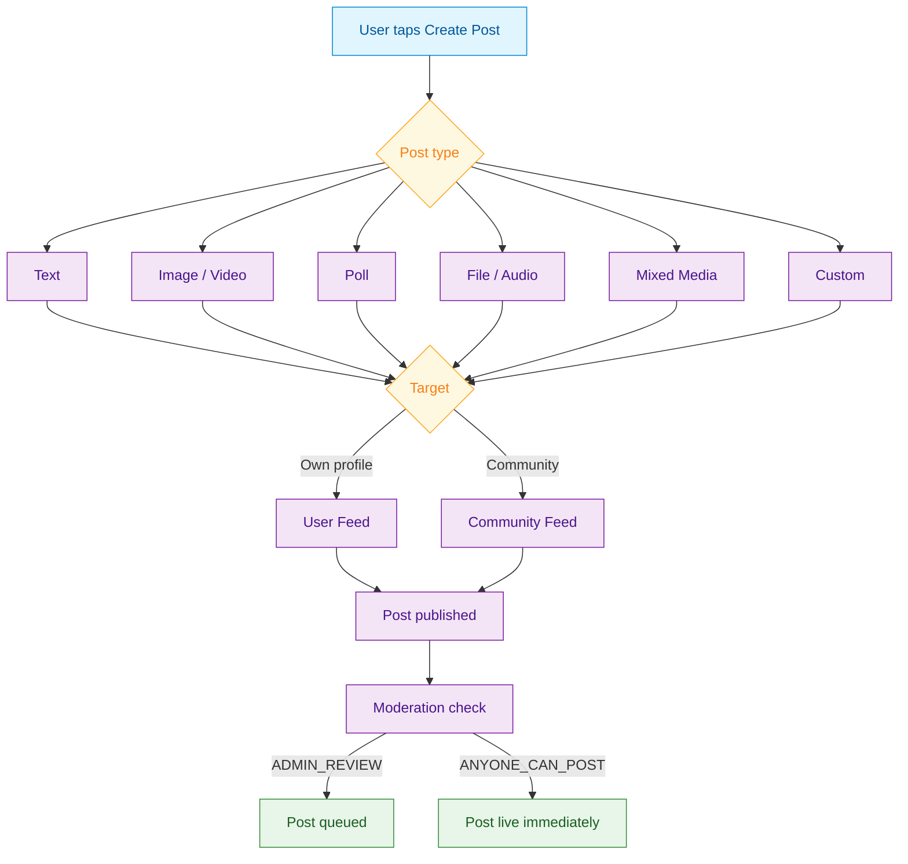

import CreateTextPost from '/snippets/social/posts/create-text-post.mdx';

<Info>**SDK v7.x** · Last verified March 2026 · iOS · Android · Web · Flutter</Info>

<Accordion title="Speed run — just the code" icon="forward">
```typescript
// 1. Create a text post
const { data: post } = await PostRepository.createPost({
  targetType: 'community', targetId: 'communityId',
  data: { text: 'Hello world!' },
});

// 2. Create an image post
const { data: imagePost } = await PostRepository.createPost({
  targetType: 'community', targetId: 'communityId',
  data: { text: 'Check this out!' },
  attachments: [{ fileId: 'uploadedFileId', type: 'image' }],
});

// 3. Create a poll post (two-step)
const { data: poll } = await PollRepository.createPoll({
  question: 'Favorite color?',
  answerType: 'single',
  answers: [{ dataType: 'text', data: 'Red' }, { dataType: 'text', data: 'Blue' }],
});
await PostRepository.createPollPost({
  pollId: poll.pollId, targetType: 'community', targetId: 'communityId',
});
```
Full walkthrough below ↓
</Accordion>

<Tip>
**Platform note** — code samples below use TypeScript. Every method has an equivalent in the iOS (Swift), Android (Kotlin), and Flutter (Dart) SDKs — see the linked SDK reference in each step.
</Tip>

Posts are the primary unit of social content. social.plus supports 11 post types — from simple text to live streams. This guide covers how to implement creation, target posts to users or communities, and attach rich metadata.



## What You'll Build

<CardGroup cols={4}>
  <Card title="Multi-format Posts" icon="file-lines">
    Text, image, video, audio, file, poll, clip, and mixed media posts with a unified API
  </Card>
  <Card title="Rich Metadata" icon="at">
    @mentions, hashtags, custom metadata, and product tagging
  </Card>
  <Card title="Flexible Targeting" icon="crosshairs">
    Post to a user's own feed or to any community they're a member of
  </Card>
  <Card title="Moderation-ready" icon="shield">
    Posts flow through configurable moderation settings and review queues automatically
  </Card>
</CardGroup>

<Info>
**Prerequisites**: SDK installed and authenticated → [SDK Setup](/social-plus-sdk/getting-started/overview). For image, video, or file posts: media upload configured → [Media Handling](/social-plus-sdk/core-concepts/content-handling/files-images-and-videos/image-handling). You'll need a `targetType` (`user` or `community`) and `targetId`.

**Also recommended:** Complete [Build a Social Feed](/use-cases/social/build-a-social-feed) first so you can see posts appear in a feed as you create them.
</Info>

<Note>
**After completing this guide you'll have:**
- A post creation flow supporting text, image, video, and poll post types
- Media upload wired up with progress tracking
- @mentions and hashtag parsing enabled
</Note>

## Limits at a Glance

| Property | Limit |
|---|---|
| Max text length | 20,000 characters |
| Max images per post | 10 |
| Max video size | 1 GB |
| Max file attachments | 10 |
| Post types | `text`, `image`, `video`, `file`, `poll`, `clip`, `livestream` |
| Mentions per post | 30 |
| Metadata size | 100 KB JSON |

---

## Quick Start: Create a Text Post

Use `AmityPostRepository` to create a text post on a community feed. The same pattern applies to all post types — just add attachments or poll data as needed. 

Full reference → [Text Post](/social-plus-sdk/social/content-management/posts/creation/text-post)

---

## Step-by-Step Implementation

<Steps>
  <Step title="Upload media (for image/video/file posts)">
    For image, video, audio, and file posts, upload the media first and use the returned file ID in the post builder.

    ```typescript TypeScript
    import { FileRepository } from '@amityco/ts-sdk';

    const data = new FormData();
    data.append('files', file); // file from <input type="file">

    const { data: image } = await FileRepository.uploadImage(
      data,
      (percent: number) => console.log(`Upload: ${percent}%`),
    );
    ```

    Full reference → [Image Handling](/social-plus-sdk/core-concepts/content-handling/files-images-and-videos/image-handling) · [Video Handling](/social-plus-sdk/core-concepts/content-handling/files-images-and-videos/video-handling)
  </Step>
  <Step title="Choose the right post type">
    | Post Type | Use Case | Reference |
    |---|---|---|
    | Text | Status updates, announcements | [Text Post](/social-plus-sdk/social/content-management/posts/creation/text-post) |
    | Image | Photo sharing | [Image Post](/social-plus-sdk/social/content-management/posts/creation/image-post) |
    | Video | Video sharing | [Video Post](/social-plus-sdk/social/content-management/posts/creation/video-post) |
    | Audio | Podcasts, voice notes | [Audio Post](/social-plus-sdk/social/content-management/posts/creation/audio-post) |
    | File | Document sharing | [File Post](/social-plus-sdk/social/content-management/posts/creation/file-post) |
    | Poll | Community votes | [Poll Post](/social-plus-sdk/social/content-management/posts/creation/poll-post) |
    | Mixed Media | Multiple images/videos | [Mixed Media Post](/social-plus-sdk/social/content-management/posts/creation/mixed-media-post) |
    | Clip | Short-form video (TikTok-style) | [Clip Post](/social-plus-sdk/social/content-management/posts/creation/clip-post) |
    | Live Stream | Live video posts | [Live Stream Post](/social-plus-sdk/social/content-management/posts/creation/live-stream-post) |
    | Custom | Any structured data | [Custom Post](/social-plus-sdk/social/content-management/posts/creation/custom-post) |

    Each reference page includes full multi-platform code examples (iOS, Android, TypeScript, Flutter).
  </Step>
  <Step title="Create image, poll, or other post types">
    Follow the same pattern as text posts — instantiate a post builder, set the target, attach media or data, and submit.

    Full reference → [Image Post](/social-plus-sdk/social/content-management/posts/creation/image-post) · [Poll Post](/social-plus-sdk/social/content-management/posts/creation/poll-post)
  </Step>
  <Step title="Add @mentions">
    Mentions trigger notifications to the mentioned users. Pass user IDs alongside their text positions in the post.

    ```typescript TypeScript
    import { PostRepository } from '@amityco/ts-sdk';

    const { data: post } = await PostRepository.createPost({
      data: { text: 'Great idea @userId1!' },
      targetType: 'community',
      targetId: 'communityId',
      mentionees: [{ type: 'user', userIds: ['userId1'] }],
      metadata: {
        mentioned: [{ userId: 'userId1', type: 'user', index: 11, length: 8 }],
      },
    });
    ```

    Full reference → [Mentions in Posts](/social-plus-sdk/core-concepts/content-handling/mentions)
  </Step>
  <Step title="Edit or delete a post">
    Update a post's text, tags, or media attachments after creation. You can also soft-delete (hides from feeds) or hard-delete (permanent removal).

    ```typescript TypeScript
    import { PostRepository } from '@amityco/ts-sdk';

    // Update a post
    const { data: updated } = await PostRepository.updatePost('postId', {
      data: { text: 'Updated content' },
      tags: ['tag1', 'tag2'],
    });

    // Soft-delete (default) — hides from feeds, recoverable
    await PostRepository.deletePost('postId');

    // Hard-delete — permanent removal
    await PostRepository.deletePost('postId', true);
    ```

    Full reference → [Edit Post](/social-plus-sdk/social/content-management/posts/moderation/edit-post) · [Delete Post](/social-plus-sdk/social/content-management/posts/moderation/delete-post)
  </Step>
</Steps>

---

## Connect to Moderation & Analytics

The Admin Console **Posts and comments management** page is the central hub for moderating content. Moderators can filter posts by feed, creator, and status, and create posts directly from the console. AI moderation status is shown inline for every post.

<Frame caption="Admin Console — Posts & comments management page for reviewing and moderating content">
  
</Frame>

You can also create posts directly from the console — useful for platform announcements or seeded content:

<Frame caption="Create posts directly from the Admin Console — useful for announcements and seeded content">
  
</Frame>

<AccordionGroup>
  <Accordion title="Post review queues" icon="hourglass">
    If your community uses `ADMIN_REVIEW_POST_REQUIRED`, new posts land in a review queue in the Admin Console. Moderators can approve, reject, or edit posts before they go live.

    → [Post Review](/social-plus-sdk/social/content-management/posts/moderation/post-review) · [Admin Console: Posts](/analytics-and-moderation/console/management/overview)
  </Accordion>
  <Accordion title="AI content moderation" icon="robot">
    Enable automatic AI screening of post text and images in **Admin Console → Settings → AI Content Moderation**. Posts with policy violations can be auto-rejected or flagged for human review.

    → [AI Content Moderation](/analytics-and-moderation/console/ai-content-moderation)
  </Accordion>
  <Accordion title="Post impression tracking" icon="chart-line">
    Track how many unique users viewed each post using impression analytics. Call `markAsViewed()` when a post enters the viewport.

    → [Post Impressions](/social-plus-sdk/social/content-management/posts/analytics/post-impressions)
  </Accordion>
  <Accordion title="Product-tagged posts in the console" icon="tag">
    Posts with product tags surface in the console with linked product cards — admins can see which products are referenced and filter posts by tag. Manage your product catalogue at **Admin Console → Product catalogue**.

    

    → [Product Tagging](/social-plus-sdk/social/content-management/posts/creation/product-tagging)
  </Accordion>
</AccordionGroup>

---

## Common Mistakes

<Warning>
**Publishing before the file upload completes** — Creating a post with an attachment before `FileRepository.uploadImage()` resolves produces a post with a broken media reference.

```typescript
// ❌ Bad — fire and forget
FileRepository.uploadImage(blob); // no await
PostRepository.createPost({ attachments: [{ fileId: '???' }] });

// ✅ Good — wait for upload
const { data: file } = await FileRepository.uploadImage(blob);
await PostRepository.createPost({ attachments: [{ fileId: file.fileId, type: 'image' }] });
```
</Warning>

<Warning>
**Exceeding the 20,000-character text limit** — Posts with text longer than 20,000 characters are rejected by the API. Validate length in your UI before calling `createPost`.
</Warning>

<Warning>
**Forgetting `targetType` and `targetId`** — Omitting these fields creates a post on the user's own feed. If you intend to post in a community, both fields are required.
</Warning>

## Best Practices

<AccordionGroup>
  <Accordion title="Media upload" icon="upload">
    - Always show an upload progress indicator for image and video posts
    - Compress images client-side before upload (recommended max: 1MB per image)
    - Implement resumable uploads for video files over 10MB
    - Handle upload failures gracefully — store the draft locally and retry
  </Accordion>
  <Accordion title="User experience" icon="heart">
    - Auto-save drafts so users don't lose work if the app is backgrounded
    - Show character count for text posts (max 20,000 characters)
    - Preview images before submission
    - Give clear feedback when a post is pending review vs. immediately published
  </Accordion>
  <Accordion title="Custom posts" icon="code">
    - Use custom posts to store structured data (product cards, event summaries, etc.)
    - Always version your custom post `dataType` string so you can evolve the schema
    - Provide a fallback renderer for unknown custom post types
  </Accordion>
</AccordionGroup>

---

## Next Steps

<Card
  title="Your next step → Comments & Reactions"
  icon="arrow-right"
  href="/use-cases/social/comments-and-reactions"
>
  Content is live — now let users engage with threaded comments and emoji reactions.
</Card>

Or explore related guides:

<CardGroup cols={3}>
  <Card title="Comments & Reactions" href="/use-cases/social/comments-and-reactions" icon="comments">
    Add engagement features to the posts you create
  </Card>
  <Card title="Build a Social Feed" href="/use-cases/social/build-a-social-feed" icon="rectangle-list">
    Display posts in a feed with real-time updates
  </Card>
  <Card title="Content Moderation Pipeline" href="/use-cases/social/content-moderation-pipeline" icon="shield-check">
    Set up review queues and AI moderation
  </Card>
</CardGroup>
