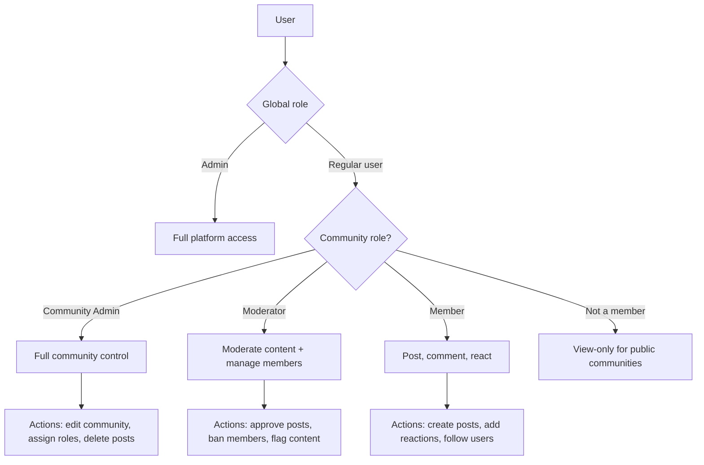

# Roles, Permissions & Governance

<Info>**SDK v6.x** · Last verified March 2026 · iOS · Android · Web · Flutter</Info>

<Accordion title="Speed run — just the code" icon="forward">
```typescript
// 1. Check if user has a specific permission
const allowed = await client.hasPermission('editCommunity')
  .community('communityId')
  .check();

// 2. Assign a community role
await CommunityRepository.Moderation.addRole(
  'communityId', ['userId'], 'moderator'
);

// 3. Remove a community role
await CommunityRepository.Moderation.removeRole(
  'communityId', ['userId'], 'moderator'
);
```
Full walkthrough below ↓
</Accordion>

As your platform grows beyond a single community, you need a permission system. social.plus provides a hierarchical RBAC model: global roles → community roles → per-action permissions. This guide covers checking permissions in the SDK, assigning community roles, and configuring governance rules.



## What You'll Build

<CardGroup cols={4}>
  <Card title="Permission Checking" icon="shield-check">
    Check whether the current user can perform specific actions before showing UI controls
  </Card>
  <Card title="Community Roles" icon="user-gear">
    Assign and manage moderator and admin roles within communities
  </Card>
  <Card title="Post Moderation Settings" icon="gavel">
    Configure per-community content governance: anyone can post, admin review, or admins only
  </Card>
  <Card title="Member Management" icon="users-gear">
    Ban, mute, and remove members using role-based authority
  </Card>
</CardGroup>

<Info>
**Prerequisites**: SDK installed and authenticated → [SDK Setup](/social-plus-sdk/getting-started/overview). At least one community created → [Create Community](/social-plus-sdk/social/communities-spaces/community-lifecycle/create-community). Admin Console access needed for global role management.

**Also recommended:** Complete [Community Platform](/use-cases/social/community-platform) first — roles and permissions govern community behavior.
</Info>

<Note>
**After completing this guide you'll have:**
- SDK permission checks (`hasPermission`) gating actions in your UI
- Community moderator role assignment and revocation working
- Post review mode (content gating) enabled in at least one community
- User ban and unban flows implemented
</Note>

---

## Quick Start: Check a Permission

```typescript TypeScript
const canEdit = await client.hasPermission({
  permission: 'EDIT_COMMUNITY_POST',
  communityId: 'community123',
});

if (canEdit) {
  showEditButton();
}
```

Full reference → [Roles & Permissions](/social-plus-sdk/core-concepts/user-management/roles-permissions)

---

## Step-by-Step Implementation

<Steps>
  <Step title="Check permissions before showing UI">
    Always check permissions before rendering action buttons (edit, delete, ban, etc.). This prevents users from seeing controls they can't use and avoids server-side permission errors.

    ```typescript TypeScript
    const canEdit = await client.hasPermission({
      permission: 'EDIT_COMMUNITY_POST',
      communityId: 'community123',
    });

    const canBan = await client.hasPermission({
      permission: 'BAN_COMMUNITY_USER',
      communityId: 'community123',
    });
    ```

    Full reference → [Roles & Permissions](/social-plus-sdk/core-concepts/user-management/roles-permissions)
  </Step>
  <Step title="Assign community moderator roles">
    Promote a member to moderator via the member management API. Moderators can approve/reject posts, ban users, and manage content within their community.

    ```typescript TypeScript
    import { CommunityRepository } from '@amityco/ts-sdk';

    // Add roles to a member
    await CommunityRepository.Moderation.addRole(communityId, 'userId', ['moderator']);

    // Remove a role
    await CommunityRepository.Moderation.removeRole(communityId, 'userId', ['moderator']);
    ```

    Full reference → [Member Management](/social-plus-sdk/social/communities-spaces/organization/member-management)
  </Step>
  <Step title="Configure post moderation settings">
    Set the `postSettings` when creating or updating a community to control who can post and whether posts need approval.

    | Setting | Who posts | Review needed | Best for |
    |---|---|---|---|
    | `ANYONE_CAN_POST` | All members | No | Open communities |
    | `ADMIN_REVIEW_POST_REQUIRED` | All members | Yes, admin approves | Curated communities |
    | `ONLY_ADMIN_CAN_POST` | Admins/mods only | No | Announcement channels |

    Full reference → [Create Community](/social-plus-sdk/social/communities-spaces/community-lifecycle/create-community)
  </Step>
  <Step title="Ban and unban community members">
    Community admins and moderators can ban members who violate guidelines. Banned users cannot view or interact with the community.

    ```typescript TypeScript
    import { CommunityRepository } from '@amityco/ts-sdk';

    // Ban a member
    await CommunityRepository.Moderation.banMembers(communityId, ['userId']);

    // Unban a member
    await CommunityRepository.Moderation.unbanMembers(communityId, ['userId']);
    ```

    Full reference → [Community Moderation](/social-plus-sdk/social/communities-spaces/governance/community-moderation)
  </Step>
  <Step title="Review and approve pending posts">
    When a community uses `ADMIN_REVIEW_POST_REQUIRED`, new posts land in the `reviewing` feed type. Check a post's `feedType` to know its state, then approve or decline it. Only users with the `REVIEW_COMMUNITY_POST` permission can take these actions.

    ```typescript TypeScript
    import { PostRepository, FeedType } from '@amityco/ts-sdk';

    // Check a post's review status
    const isUnderReview = post.feedType === FeedType.Reviewing;
    const isPublished  = post.feedType === FeedType.Published;
    const isDeclined   = post.feedType === FeedType.Declined;

    // Approve — moves post to published feed
    await PostRepository.approvePost(post.postId);

    // Decline — moves post to declined feed (author can still see it)
    await PostRepository.declinePost(post.postId);
    ```

    Full reference → [Post Review](/social-plus-sdk/social/content-management/posts/moderation/post-review)
  </Step>
  <Step title="Manage global roles in the Admin Console">
    Global roles (super admin, admin, support) are managed in **Admin Console → Settings → Admin Access Control**. These roles grant cross-community permissions.

    → [Admin Console: Roles & Privileges](/analytics-and-moderation/console/moderation/roles-and-privileges)
  </Step>
</Steps>

---

## Permission Reference

| Permission | Description | Who has it by default |
|---|---|---|
| `EDIT_COMMUNITY_POST` | Edit any post in a community | Community admin, moderator |
| `DELETE_COMMUNITY_POST` | Delete any post in a community | Community admin, moderator |
| `BAN_COMMUNITY_USER` | Ban/unban members | Community admin, moderator |
| `EDIT_COMMUNITY` | Change community name, description, settings | Community admin |
| `REVIEW_COMMUNITY_POST` | Approve/decline posts in review queue | Community admin, moderator |
| `MUTE_COMMUNITY_USER` | Temporarily silence a member | Community admin, moderator |

---

## 🔗 Connect to Moderation & Analytics

<AccordionGroup>
  <Accordion title="Admin Console: role management" icon="shield">
    Create custom roles with specific permission sets in **Admin Console → Settings → Roles**. Assign users to roles globally or per-community.

    → [Roles & Privileges](/analytics-and-moderation/console/moderation/roles-and-privileges)
  </Accordion>
  <Accordion title="Moderation audit trail" icon="clipboard-list">
    All moderator actions (ban, post removal, role change) are logged. Review the audit trail in **Admin Console → Moderation → Activity Log** for compliance.
  </Accordion>
  <Accordion title="Webhook: role change events" icon="webhook">
    Receive `community.role.assigned` and `community.role.removed` webhook events to sync role state with your backend or trigger notifications.

    → [Webhook Events](/analytics-and-moderation/social+-apis-and-services/webhook-event)
  </Accordion>
</AccordionGroup>

---

## Common Mistakes

<Warning>
**Checking permissions only on the client** — Client-side permission checks are for UI gating only. The server enforces permissions regardless, but relying solely on client checks creates a confusing UX when the server rejects an action.
</Warning>

<Warning>
**Assigning roles without verifying the assigner's permission** — Only users with `editCommunityUser` permission can assign roles. Check this before showing the role assignment UI to avoid failed requests.
</Warning>

<Warning>
**Forgetting that global roles override community roles** — A global admin can do anything in any community, even without a community-level role. Don't build UI that implies global admins need community roles.
</Warning>

## Best Practices

<AccordionGroup>
  <Accordion title="Defense in depth" icon="shield-check">
    - Check permissions in the SDK before showing UI elements (buttons, menus)
    - The server enforces permissions even if the client doesn't check — but a good UX never shows controls a user can't use
    - Assign at least 2 moderators per community to avoid single-point-of-failure moderation
    - Use `ADMIN_REVIEW_POST_REQUIRED` for communities with compliance requirements (healthcare, finance, education)
  </Accordion>
  <Accordion title="Role hierarchy design" icon="sitemap">
    - Keep your role hierarchy flat: admin → moderator → member is sufficient for most apps
    - Don't create more than 3-4 custom roles — complexity creates confusion
    - Define clear escalation paths: moderator handles content, admin handles users, super admin handles settings
    - Document role responsibilities in community guidelines
  </Accordion>
  <Accordion title="User experience" icon="heart">
    - Show a "You're now a moderator" notification when someone is promoted
    - Surface moderation tools contextually: show "Approve" button inline on queued posts, not buried in settings
    - Give moderators a dedicated "Mod queue" view with pending posts and flagged content
    - Let users see their own role in the community header ("You are a Moderator")
  </Accordion>
</AccordionGroup>

---

## Next Steps

<Card
  title="Your next step → Content Moderation Pipeline"
  icon="arrow-right"
  href="/use-cases/social/content-moderation-pipeline"
>
  Roles are set — now wire up the moderation pipeline with flagging, AI review, and webhooks.
</Card>

Or explore related guides:

<CardGroup cols={3}>
  <Card title="Community Platform" href="/use-cases/social/community-platform" icon="users">
    Build communities that use these governance rules
  </Card>
  <Card title="Content Moderation Pipeline" href="/use-cases/social/content-moderation-pipeline" icon="shield-check">
    Set up the full moderation workflow
  </Card>
  <Card title="User Profiles & Social Graph" href="/use-cases/social/user-profiles-and-social-graph" icon="user-group">
    Manage user relationships and blocking
  </Card>
</CardGroup>
