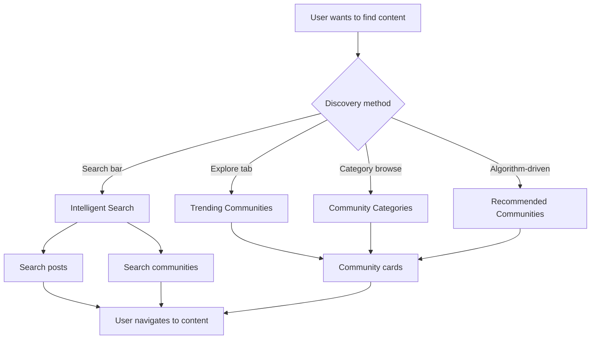

# Search & Discovery

Discovery turns a closed social app into a growing platform. This guide walks through implementing full-text search for posts and communities, surfacing trending content, and building a category-based browsing experience.



## What You'll Build

<CardGroup cols={2}>
  <Card title="Post Search" icon="magnifying-glass">
    Full-text search across posts with filtering by community, data type, and sort order
  </Card>
  <Card title="Community Search" icon="users-rectangle">
    Search communities by name with live results and category filtering
  </Card>
  <Card title="Trending & Recommended" icon="fire">
    Surface trending communities and algorithmically recommended communities for new users
  </Card>
  <Card title="Category Browsing" icon="tag">
    Organize communities into categories and let users browse by interest
  </Card>
</CardGroup>

## Prerequisites

- SDK installed and authenticated
- Communities must be public to appear in search results (private communities are excluded)

import SearchPosts from '/snippets/social/search/search-posts.mdx';

---

## Quick Start: Search Communities

Community search is the primary discovery surface — query by name with optional membership and category filters:

```typescript TypeScript
import { CommunityRepository } from '@amityco/ts-sdk';

const unsubscriber = CommunityRepository.semanticSearchCommunities(
  {
    query: 'gaming',
    communityMembershipStatus: CommunityRepository.AmityCommunityMemberStatusFilter.ALL,
  },
  ({ data: communities, onNextPage, hasNextPage, loading }) => {
    if (communities) { /* render community search results */ }
  },
);
```

Full reference → [Intelligent Search: Communities](/social-plus-sdk/social/discovery-engagement/search/intelligent-search-community)

---

## Step-by-Step Implementation

<Steps>
  <Step title="Search communities">
    Search communities by name with optional filters: membership status (`all`, `member`, `notMember`), sort order, and category.

    ```typescript TypeScript
    import { CommunityRepository } from '@amityco/ts-sdk';

    const unsubscriber = CommunityRepository.semanticSearchCommunities(
      { query: 'game', communityMembershipStatus: CommunityRepository.AmityCommunityMemberStatusFilter.ALL },
      ({ data: communities, onNextPage, hasNextPage, loading }) => {
        if (communities) { /* render community results */ }
      },
    );
    ```

    Full reference → [Intelligent Search: Communities](/social-plus-sdk/social/discovery-engagement/search/intelligent-search-community)
  </Step>
  <Step title="Get trending communities">
    Trending communities are ranked by recent activity (posts, members, engagement). Surface these on your explore page for new users.

    ```typescript TypeScript
    import { CommunityRepository } from '@amityco/ts-sdk';

    const unsubscriber = CommunityRepository.getTrendingCommunities(
      { limit: 5 },
      ({ data: communities, loading }) => {
        if (communities) { /* render trending section */ }
      },
    );
    ```

    Full reference → [Trending & Recommended Communities](/social-plus-sdk/social/communities-spaces/discovery/trending-and-recommended-communities)
  </Step>
  <Step title="Get recommended communities">
    Recommended communities are personalized for the current user based on their activity and interests. Returns up to 15 communities.

    ```typescript TypeScript
    import { CommunityRepository } from '@amityco/ts-sdk';

    const unsubscriber = CommunityRepository.getRecommendedCommunities(
      { limit: 5, includeDiscoverablePrivateCommunity: true },
      ({ data: communities, loading }) => {
        if (communities) { /* render recommended section */ }
      },
    );
    ```

    Full reference → [Trending & Recommended Communities](/social-plus-sdk/social/communities-spaces/discovery/trending-and-recommended-communities)
  </Step>
  <Step title="Browse communities by category">
    Organize communities into browsable categories. Query all categories, then filter communities by a selected category.

    ```typescript TypeScript
    import { CategoryRepository } from '@amityco/ts-sdk';

    const unsubscriber = CategoryRepository.getCategories(
      {},
      ({ data: categories, loading }) => {
        if (categories) { /* render category filter pills */ }
      },
    );
    ```

    Full reference → [Community Categories](/social-plus-sdk/social/communities-spaces/organization/community-categories) · [Query Communities](/social-plus-sdk/social/communities-spaces/discovery/query-communities)
  </Step>
  <Step title="Search posts">
    Full-text search across all posts with optional filters: community scope, post type, and sort order. Useful for a global search bar or in-community search.

    <SearchPosts />

    Full reference → [Intelligent Search: Posts](/social-plus-sdk/social/discovery-engagement/search/intelligent-search-post)
  </Step>
</Steps>

---

## Connect to Moderation & Analytics

<AccordionGroup>
  <Accordion title="Analytics: search usage" icon="chart-bar">
    Track search query volume and discovery patterns in **Admin Console → Analytics Dashboard → Social Insights** to understand what users are looking for and which communities are growing.

    → [Admin Console: Analytics](/analytics-and-moderation/console/analytics/)
  </Accordion>
  <Accordion title="Admin: category management" icon="tag">
    Create and manage community categories in the Admin Console. Categories appear in the community creation flow and in the discovery browse view.

    → [Admin Console: Product Management](/analytics-and-moderation/console/management/overview)
  </Accordion>
</AccordionGroup>

---

## Best Practices

<AccordionGroup>
  <Accordion title="Search UX" icon="magnifying-glass">
    - Add a 300ms debounce to search input before firing the query — prevents excessive API calls while the user types
    - Show suggested/recent searches before the user starts typing
    - Display skeleton placeholders while results load
    - Clearly differentiate post results from community results with distinct card styles
    - Show a "No results" empty state with suggestions if the query returns 0 results
  </Accordion>
  <Accordion title="Explore/Discover UX" icon="compass">
    - Show trending communities prominently for logged-in users with no following history
    - Once a user has joined 5+ communities, replace trending with personalized recommendations
    - Use horizontal scrolling category pills for browsing — they take less vertical space than a list
    - Cache trending and recommended results for 5-10 minutes — they don't need to be real-time
  </Accordion>
  <Accordion title="Performance" icon="gauge">
    - Use `searchPosts()` Live Collection — this handles debounced re-querying automatically on most platforms
    - Limit search result sets to 20-30 items; use pagination for deeper results
    - Pre-load categories at app launch and cache locally — they change infrequently
  </Accordion>
</AccordionGroup>

---

## Next Steps

<CardGroup cols={3}>
  <Card title="Community Platform" href="/use-cases/social/community-platform" icon="users">
    Build the communities that discovery surfaces
  </Card>
  <Card title="Build a Social Feed" href="/use-cases/social/build-a-social-feed" icon="rectangle-list">
    Show content from discovered communities in a feed
  </Card>
  <Card title="Notifications & Engagement" href="/use-cases/social/notifications-and-engagement" icon="bell">
    Notify users about trending content they'd be interested in
  </Card>
</CardGroup>
