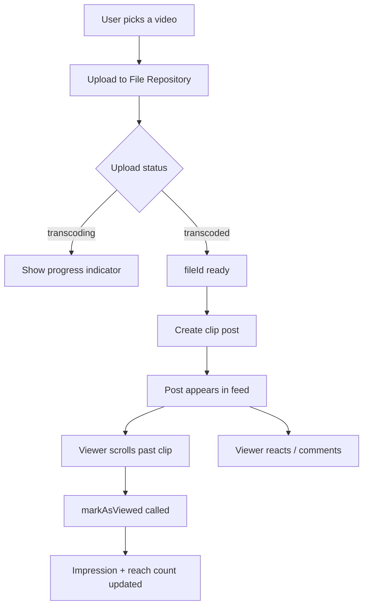

# Short-Form Video Clips

Clip posts let users share videos up to 15 minutes directly in community and user feeds. They are distinct from livestream posts (live broadcast) and regular video posts — they're purpose-built for short-form, scrollable video content with full reactions, comments, and impression tracking. This guide walks through uploading a clip, publishing it to a feed, and displaying a clip reel.



## What You'll Build

<CardGroup cols={2}>
  <Card title="Upload & Publish" icon="upload">
    Upload a video file, wait for transcoding, then publish a clip post to a community or user feed
  </Card>
  <Card title="Scrollable Clip Reel" icon="film">
    Query clip posts for a user or community and render a vertically scrollable reel
  </Card>
  <Card title="Engagement" icon="heart">
    Reactions, comments, and impression tracking work out of the box on every clip post
  </Card>
  <Card title="Display Modes" icon="expand">
    Control how the video fills its container — `fill` (crop to fit) or `fit` (letterbox)
  </Card>
</CardGroup>

## Limits at a Glance

| Property | Limit |
|---|---|
| Max file size | 2 GB |
| Max duration | 15 minutes |
| Supported formats | 3gp, avi, f4v, flv, m4v, mov, mp4, ogv, 3g2, wmv, vob, webm, mkv |
| Caption length | 10,000 characters |

---

## Quick Start: Create a Clip Post

```typescript TypeScript
import { PostRepository, PostContentType } from '@amityco/ts-sdk';

const { data: post } = await PostRepository.createClipPost({
  data: { text: 'Check out this moment!' },
  attachments: [
    { fileId: 'videoFileId1', type: PostContentType.CLIP, displayMode: 'fill', isMuted: false },
  ],
  targetType: 'community',
  targetId: 'communityId1',
});
```

Full reference → [Clip Posts](/social-plus-sdk/social/content-management/posts/creation/clip-post)

---

## Step-by-Step Implementation

<Steps>
  <Step title="Upload the video file">
    Upload the raw video file before creating the post. The SDK returns a `fileId` once the upload is complete. Transcoding then happens automatically in the background.

    ```typescript TypeScript
    import { FileRepository } from '@amityco/ts-sdk';

    // uploadFile accepts a File (web) or file path (native)
    const { data: uploadedFile } = await FileRepository.uploadVideo(videoFile, {
      onProgress: (progress) => console.log(`Upload: ${progress}%`),
    });

    const fileId = uploadedFile.fileId;
    ```

    Full reference → [Video Handling](/social-plus-sdk/core-concepts/content-handling/files-images-and-videos/video-handling)
  </Step>
  <Step title="Create the clip post">
    Pass the `fileId` as an attachment. Set `displayMode` to `'fill'` for vertical reels (TikTok-style) or `'fit'` to letterbox horizontal video.

    ```typescript TypeScript
    import { PostRepository, PostContentType } from '@amityco/ts-sdk';

    const { data: post } = await PostRepository.createClipPost({
      data: { text: 'Behind the scenes 🎬' },
      attachments: [
        {
          fileId,
          type: PostContentType.CLIP,
          displayMode: 'fill',   // 'fill' crops to container; 'fit' letterboxes
          isMuted: false,         // start unmuted
        },
      ],
      targetType: 'community',   // 'community' or 'user'
      targetId: communityId,
    });
    ```

    Full reference → [Clip Posts](/social-plus-sdk/social/content-management/posts/creation/clip-post)
  </Step>
  <Step title="Display a clip reel">
    Query clip posts for a community or user feed. Filter by `PostContentType.CLIP` to build a dedicated clips tab. Render each post as a full-screen vertical video card.

    ```typescript TypeScript
    import { PostRepository } from '@amityco/ts-sdk';

    const unsubscribe = PostRepository.getPosts(
      {
        targetType: 'community',
        targetId: communityId,
        dataTypes: ['clip'],   // filter to clips only
        limit: 10,
      },
      ({ data: posts, hasNextPage, onNextPage }) => {
        renderClipReel(posts);
        // loadMoreButton.onClick = onNextPage when hasNextPage is true
      },
    );
    ```

    Full reference → [Query Posts](/social-plus-sdk/social/content-management/posts/retrieval/query-posts)
  </Step>
  <Step title="Track impressions as users scroll">
    Call `markAsViewed()` when a clip is at least 50% visible for 1 second. This updates the post's `impression` (total views) and `reach` (unique viewers) counters.

    ```typescript TypeScript
    import { PostRepository } from '@amityco/ts-sdk';

    // Called from your IntersectionObserver / viewability tracker
    function onClipVisible(post: Amity.Post) {
      post.analytics.markAsViewed();
      console.log(`Impressions: ${post.impression}, Reach: ${post.reach}`);
    }
    ```

    Full reference → [Post Impressions](/social-plus-sdk/social/content-management/posts/analytics/post-impressions)
  </Step>
  <Step title="Add reactions and comments">
    Clip posts support the same reactions and comments as any other post type — no additional setup required.

    ```typescript TypeScript
    import { ReactionRepository } from '@amityco/ts-sdk';

    // Add a heart reaction to a clip post
    await ReactionRepository.addReaction('post', post.postId, 'heart');
    ```

    Full reference → [Reactions](/social-plus-sdk/core-concepts/content-handling/reactions)
  </Step>
</Steps>

---

## Connect to Moderation & Analytics

<AccordionGroup>
  <Accordion title="Impression analytics in the console" icon="chart-bar">
    Impression and reach data rolls up to **Admin Console → Analytics → Content**. Filter by post type to see clip-specific engagement trends across communities.
  </Accordion>
  <Accordion title="Flag inappropriate clips" icon="flag">
    Users can flag clip posts with the same SDK flagging APIs used for other content. Flagged clips surface in **Admin Console → Moderation → Flagged Content**.

    ```typescript TypeScript
    import { PostRepository } from '@amityco/ts-sdk';
    await PostRepository.flagPost(post.postId);
    ```

    Full reference → [Content Moderation Pipeline](/use-cases/social/content-moderation-pipeline)
  </Accordion>
  <Accordion title="Webhook: clip post events" icon="webhook">
    Receive `post.created` and `post.deleted` webhook events filtered to `dataType: 'clip'` to trigger downstream workflows like CDN pre-warming or notification dispatch.

    → [Webhook Events](/analytics-and-moderation/social+-apis-and-services/webhook-event)
  </Accordion>
</AccordionGroup>

---

## Best Practices

<AccordionGroup>
  <Accordion title="Upload UX" icon="upload">
    - Show a progress bar during upload — clip files can be up to 2 GB
    - After upload completes, poll the file's `status` field until it reaches `transcoded` before publishing the post. Show a "Processing…" state in the meantime
    - Validate file size and duration on the client before uploading to give instant feedback
  </Accordion>
  <Accordion title="Clip reel UX" icon="film">
    - Auto-play clips when they scroll into view; pause immediately on scroll away
    - Default to `isMuted: true` for autoplay in feeds to comply with browser autoplay policies
    - Show a tap-to-unmute affordance visibly on the first clip
    - Use `displayMode: 'fill'` for portrait clips and `'fit'` for landscape
  </Accordion>
  <Accordion title="Performance" icon="gauge">
    - Pre-load the next clip in the reel while the current one is playing to eliminate inter-clip buffer
    - Use the `720p` transcoded URL for mobile playback — the original resolution is usually excessive
    - Pause and release memory for clips that are more than 2 positions away from the current view
  </Accordion>
</AccordionGroup>

---

## Next Steps

<CardGroup cols={3}>
  <Card title="Post Impressions & Creator Analytics" href="/use-cases/social/post-impressions-and-creator-analytics" icon="chart-line">
    Build a creator dashboard with per-post impression, reach, and viewed-users data
  </Card>
  <Card title="Rich Content Creation" href="/use-cases/social/rich-content-creation" icon="pen-to-square">
    Other post types — images, text, polls, files — in one guide
  </Card>
  <Card title="Comments & Reactions" href="/use-cases/social/comments-and-reactions" icon="comments">
    Add threaded comments and emoji reactions to clip posts
  </Card>
</CardGroup>
