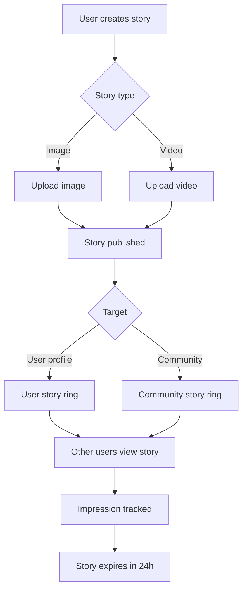

# Stories & Ephemeral Content

Stories are 24-hour ephemeral content units that drive daily active usage. This guide covers creating image and video stories, rendering story rings, tracking views and impressions, and targeting stories to users or communities.



## What You'll Build

<CardGroup cols={2}>
  <Card title="Story Creation" icon="circle-plus">
    Create image and video stories with custom hyperlinks and metadata
  </Card>
  <Card title="Story Rings" icon="circle">
    Display story rings on user profiles and community headers — distinguishing seen vs. unseen stories
  </Card>
  <Card title="Story Viewer" icon="eye">
    Render stories full-screen with tap-to-advance navigation and reaction support
  </Card>
  <Card title="Impression Analytics" icon="chart-bar">
    Track reach and view counts per story with server-side analytics
  </Card>
</CardGroup>

## Prerequisites

- SDK installed and authenticated
- For video stories: Video upload configured → [Video Handling](/social-plus-sdk/core-concepts/content-handling/files-images-and-videos/video-handling)
- A `targetType` (`user` or `community`) and `targetId`

import CreateImageStory from '/snippets/social/stories/create-image-story.mdx';

---

## Quick Start: Create an Image Story

<CreateImageStory />

---

## Step-by-Step Implementation

<Steps>
  <Step title="Get story targets (story rings)">
    Story targets are the entities (users or communities) that have active stories. Each target has a `hasUnseenStory` flag you can use to highlight the ring.

    ```typescript TypeScript
    import { StoryRepository } from '@amityco/ts-sdk';

    const unsubscribe = StoryRepository.getStoriesByTargetIds(
      {
        targets: [
          { targetType: 'community', targetId: 'communityId_1' },
          { targetType: 'community', targetId: 'communityId_2' },
        ],
        options: { orderBy: 'asc' },
      },
      ({ data: storiesData, loading }) => {
        if (storiesData) { /* render story rings */ }
      },
    );
    ```

    Full reference → [Get Story Targets](/social-plus-sdk/social/content-management/stories/retrieval/get-story-targets)
  </Step>
  <Step title="Get global story targets (explore/discover)">
    For an explore page, query all communities with active stories.

    ```typescript TypeScript
    import { StoryRepository } from '@amityco/ts-sdk';

    const unsubscribe = StoryRepository.getGlobalStoryTargets(
      { seenState: Amity.StorySeenQuery.SMART, limit: 10 },
      ({ data, onNextPage, hasNextPage }) => {
        /* render explore story bar */
      },
    );
    ```

    Full reference → [Get Global Story Targets](/social-plus-sdk/social/content-management/stories/retrieval/get-global-story-targets)
  </Step>
  <Step title="Get stories for a target">
    Query individual stories for a specific user or community to display in the full-screen viewer.

    ```typescript TypeScript
    const unsubscribe = StoryRepository.getActiveStoriesByTarget(
      { targetType: 'community', targetId: 'communityId' },
      ({ data: stories, loading }) => {
        if (stories) { /* open full-screen story viewer */ }
      },
    );
    ```

    Full reference → [Get Stories](/social-plus-sdk/social/content-management/stories/retrieval/get-stories)
  </Step>
  <Step title="Track story impressions">
    When a story is shown full-screen, call `markAsSeen()` to record the view impression. View analytics in **Admin Console → Social Management → Stories**.

    ```typescript TypeScript
    // Inside the story viewer callback:
    storiesData.forEach(storyItem => {
      if (storyItem) storyItem.analytics.markAsSeen();
    });
    ```

    Full reference → [Story Impressions](/social-plus-sdk/social/content-management/stories/analytics/story-impressions)
  </Step>
  <Step title="Add reactions to stories">
    Stories support the same reaction system as posts. Use `ReactionRepository` with `referenceType: 'story'` and the story ID.

    ```typescript TypeScript
    import { ReactionRepository } from '@amityco/ts-sdk';

    // Add a reaction to a story
    await ReactionRepository.addReaction('story', 'storyId', 'like');

    // Remove a reaction
    await ReactionRepository.removeReaction('story', 'storyId', 'like');
    ```

    Full reference → [Reactions](/social-plus-sdk/core-concepts/content-handling/reactions)
  </Step>
</Steps>

---

## Connect to Moderation & Analytics

<AccordionGroup>
  <Accordion title="Story impressions & reach" icon="chart-bar">
    View total views, unique viewers, and per-story impression data in **Admin Console → Social Management → Stories**. Programmatic access via `story.impressions` in the SDK.

    → [Story Impressions](/social-plus-sdk/social/content-management/stories/analytics/story-impressions)
  </Accordion>
  <Accordion title="Moderation: flagging stories" icon="flag">
    Users can flag inappropriate stories. Flagged stories appear in the Admin Console for moderator action.

    → [Content Flagging](/social-plus-sdk/social/content-management/moderation/content-flagging)
  </Accordion>
  <Accordion title="Community story settings" icon="gear">
    Per-community story settings control whether comments are allowed on community stories. Configure in the Admin Console or via the SDK when creating/updating a community.

    → [Create Community](/social-plus-sdk/social/communities-spaces/community-lifecycle/create-community)
  </Accordion>
</AccordionGroup>

---

## Best Practices

<AccordionGroup>
  <Accordion title="Story rings UX" icon="circle">
    - Use a colored ring for unseen stories, a grey/transparent ring for fully seen stories
    - Order story rings: currently-active user's story → friends → communities
    - Show a "+" button on the current user's ring to open the creation flow
    - Animate the ring on tap to give tactile feedback before opening the viewer
  </Accordion>
  <Accordion title="Story viewer" icon="eye">
    - Auto-advance to the next story after ~5-7 seconds for images, or at video end
    - Allow tap-left / tap-right to navigate between stories
    - Show a progress bar across the top of the viewer for each story segment
    - Pause auto-advance when the user long-presses (hold to read)
  </Accordion>
  <Accordion title="Performance" icon="gauge">
    - Pre-fetch stories for the first 3 targets in the story ring so they open instantly
    - Compress images to ≤1MB before upload — story images are full-screen and load time matters
    - For video stories, start downloading the next story's video while the current one plays
  </Accordion>
</AccordionGroup>

---

## Next Steps

<CardGroup cols={3}>
  <Card title="Rich Content Creation" href="/use-cases/social/rich-content-creation" icon="pen-to-square">
    Create posts alongside stories for a complete content loop
  </Card>
  <Card title="Notifications & Engagement" href="/use-cases/social/notifications-and-engagement" icon="bell">
    Notify users when someone reacts to their story
  </Card>
  <Card title="Build a Social Feed" href="/use-cases/social/build-a-social-feed" icon="rectangle-list">
    Combine a story bar at the top of the feed
  </Card>
</CardGroup>
