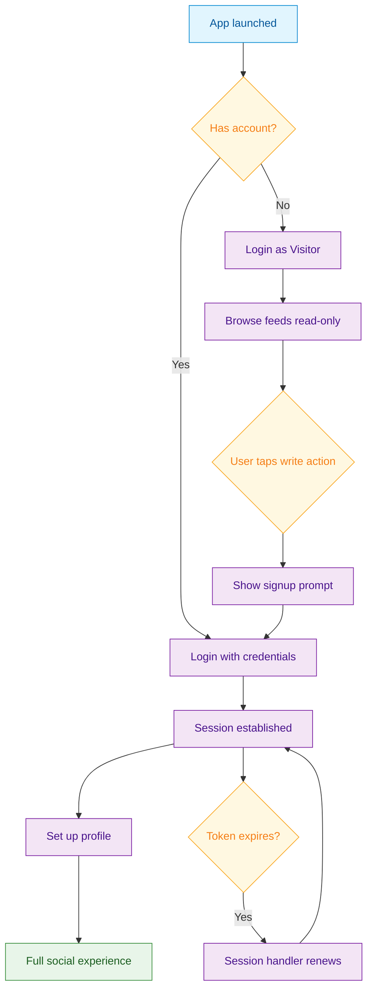

<Info>**SDK v7.x** · Last verified March 2026 · iOS · Android · Web · Flutter</Info>

<Accordion title="Speed run — just the code" icon="forward">
```typescript
// 1. Visitor login (anonymous, read-only)
await Client.loginAsVisitor();

// 2. Upgrade to authenticated user
await Client.login({ userId: 'user-123', displayName: 'Jane' });

// 3. Update the user profile
await UserRepository.updateUser('user-123', {
  displayName: 'Jane Doe',
  description: 'Hello world!',
  avatarFileId: 'uploaded-avatar-id',
});
```
Full walkthrough below ↓
</Accordion>

A great onboarding funnel lets users browse before committing. social.plus supports three user types — visitors (anonymous, read-only), authenticated users (full access), and bots (crawler/SEO). This guide walks through the entire flow from first launch to complete profile.



## What You'll Build

<CardGroup cols={4}>
  <Card title="Visitor Mode" icon="eye">
    Anonymous read-only access so users can browse feeds, communities, and profiles before signing up
  </Card>
  <Card title="Authenticated Login" icon="right-to-bracket">
    Full login flow with session handlers, token refresh, and state observation
  </Card>
  <Card title="Profile Setup" icon="user-pen">
    Update display name, avatar, and bio after first login
  </Card>
  <Card title="Session Management" icon="rotate">
    Observe session states, handle token expiry, and manage secure logout
  </Card>
</CardGroup>

<Info>
**Prerequisites**: SDK installed → [SDK Setup](/social-plus-sdk/getting-started/overview), plus an API key from the social.plus console. Production apps also need a backend server to generate auth tokens.
</Info>

<Note>
**After completing this guide you'll have:**
- Visitor mode enabled so unauthenticated users can browse content
- A smooth visitor → authenticated transition with session continuity
- Profile setup step (display name, avatar) at first login
</Note>

---

## Quick Start: Login as Visitor

Let users browse your app without creating an account:

```typescript TypeScript
import { Client } from '@amityco/ts-sdk';

const client = Client.createClient('your-api-key', 'sg');

await Client.loginAsVisitor({ sessionHandler });
```

Full reference → [Visitor Mode](/social-plus-sdk/getting-started/visitor-mode)

---

## Step-by-Step Implementation

<Steps>
  <Step title="Initialize the SDK">
    Create the client once at app startup. This must happen before any login call.

    ```typescript TypeScript
    import { Client } from '@amityco/ts-sdk';

    const client = Client.createClient('your-api-key', 'sg');
    ```

    Full reference → [Authentication](/social-plus-sdk/getting-started/authentication)
  </Step>
  <Step title="Login as a visitor (anonymous browsing)">
    Visitors get read-only access — they can view feeds, communities, and profiles but cannot post, comment, react, or follow. The SDK skips MQTT connections and push notification registration for visitors, saving resources.

    ```typescript TypeScript
    try {
      await Client.loginAsVisitor({ sessionHandler });
      console.log('Visitor login successful');
    } catch (error) {
      console.error('Visitor login failed:', error);
    }
    ```

    Full reference → [Visitor Mode](/social-plus-sdk/getting-started/visitor-mode)
  </Step>
  <Step title="Detect user type and gate write actions">
    Check the current user type before allowing write operations. Show a signup prompt when visitors try to interact.

    ```typescript TypeScript
    import { Client, UserTypeEnum } from '@amityco/ts-sdk';

    const userType = Client.getCurrentUserType();
    if (userType === UserTypeEnum.VISITOR) {
      // Show signup/login prompt
      showSignupModal('Create an account to post');
    }
    ```

    Full reference → [Visitor Mode](/social-plus-sdk/getting-started/visitor-mode)
  </Step>
  <Step title="Login with authentication">
    After the user signs up or logs in through your auth system, call the authenticated login. In production, always pass an `authToken` generated by your backend.

    ```typescript TypeScript
    try {
      await client.login({
        userId: 'user-123',
        displayName: 'John Doe',
        authToken: 'token-from-your-backend', // Required in production
      }, sessionHandler);
      console.log('Login successful');
    } catch (error) {
      console.error('Login failed:', error);
    }
    ```

    Full reference → [Authentication](/social-plus-sdk/getting-started/authentication)
  </Step>
  <Step title="Observe session state changes">
    Monitor the session lifecycle to show the right UI: loading spinner during `establishing`, navigate to app on `established`, re-auth prompt on `tokenExpired`.

    ```typescript TypeScript
    import { Client } from '@amityco/ts-sdk';

    Client.onSessionStateChange((state: Amity.SessionStates) => {
      switch (state) {
        case 'established':
          navigateToApp();
          break;
        case 'tokenExpired':
          showTokenRefreshIndicator();
          break;
        case 'terminated':
          handleSessionTermination();
          break;
      }
    });
    ```

    Full reference → [Authentication](/social-plus-sdk/getting-started/authentication)
  </Step>
  <Step title="Set up the user profile">
    After first login, let users set their display name, bio, and avatar. The SDK auto-creates the user record on first login — this step updates it.

    ```typescript TypeScript
    import { UserRepository } from '@amityco/ts-sdk';

    const { data: updatedUser } = await UserRepository.updateUser('userId', {
      displayName: 'Jane Smith',
      description: 'Loves hiking and photography',
    });
    ```

    Full reference → [Update User Information](/social-plus-sdk/core-concepts/user-management/user-operations/update-user-information)
  </Step>
  <Step title="Implement session handler for token refresh">
    In production, tokens expire. The session handler lets the SDK request a fresh token from your backend without interrupting the user.

    ```typescript TypeScript
    const sessionHandler: Amity.SessionHandler = {
      sessionWillRenewAccessToken: async (renewal: Amity.AccessTokenRenewal) => {
        try {
          const newToken = await AuthService.refreshToken();
          renewal.renewWithAuthToken(newToken);
        } catch (error) {
          renewal.unableToRetrieveAuthToken();
        }
      },
    };
    ```

    Full reference → [Authentication](/social-plus-sdk/getting-started/authentication)
  </Step>
  <Step title="Secure logout">
    Always call `secureLogout()` when the user logs out. This clears the session, stops real-time connections, and unregisters push tokens.

    ```typescript TypeScript
    await Client.secureLogout();
    ```

    Full reference → [Authentication](/social-plus-sdk/getting-started/authentication)
  </Step>
</Steps>

---

## 🔗 Connect to Moderation & Analytics

<AccordionGroup>
  <Accordion title="Visitor analytics" icon="chart-bar">
    Track how many visitors browse vs. convert to authenticated users. Visitor device IDs are available via `client.getVisitorDeviceId()` for analytics attribution.
  </Accordion>
  <Accordion title="Bot mode for SEO" icon="robot">
    Use `Client.loginAsBot()` for search engine crawlers to index public content. Bots have even more restricted permissions than visitors — they can only read, never interact.

    → [Visitor Mode — Bot Users](/social-plus-sdk/getting-started/visitor-mode)
  </Accordion>
  <Accordion title="Webhook: user created" icon="webhook">
    Receive a `user.created` webhook event when a visitor converts to an authenticated user (first login). Use this to trigger welcome emails or onboarding flows.

    → [Webhook Events](/analytics-and-moderation/social+-apis-and-services/webhook-event)
  </Accordion>
</AccordionGroup>

---

## Common Mistakes

<Warning>
**Hardcoding auth tokens in client-side code** — Auth tokens should be generated server-side. Embedding them in your app exposes them to extraction.

```typescript
// ❌ Bad — token in source code
await Client.login({ userId: 'u1', authToken: 'hardcoded-secret' });

// ✅ Good — fetch token from your backend
const { authToken } = await yourServer.getAmityToken(currentUser.id);
await Client.login({ userId: currentUser.id, authToken });
```
</Warning>

<Warning>
**Skipping the session handler** — Without a session handler, expired sessions silently fail. Always implement `sessionHandler` to detect token expiry and re-authenticate.
</Warning>

<Warning>
**Calling write APIs as a visitor** — Visitors are read-only. Attempting to create posts or reactions as a visitor throws a permission error. Gate write actions behind an authentication check.
</Warning>

## Best Practices

<AccordionGroup>
  <Accordion title="Conversion funnel" icon="funnel-dollar">
    - Show a subtle "Sign up for full access" banner while visitors browse — don't block the experience
    - Track which actions visitors attempt most (post, react, comment) to optimize your signup prompt placement
    - Pre-fill the display name from your auth provider so users don't have to type it twice
    - Gate write actions at the UI layer (disable buttons) rather than catching SDK errors
  </Accordion>
  <Accordion title="Security" icon="shield">
    - **Never ship without auth tokens in production** — without them, anyone can impersonate any `userId`
    - Use `secureLogout()` on every logout path (manual logout, session expiry, account deletion)
    - Implement the session handler — without it, sessions will fail silently when tokens expire
    - Store auth tokens server-side and pass them to the client at login time; never generate tokens client-side
  </Accordion>
  <Accordion title="Performance" icon="gauge">
    - Visitors skip MQTT connections and push notification registration automatically — no extra optimization needed
    - Cache the user type check result per session; `getCurrentUserType()` is synchronous and fast
    - For SSR/SEO, use bot mode to pre-render public content without consuming authenticated user slots
  </Accordion>
</AccordionGroup>

---

## Next Steps

<Card
  title="Your next step → Build a Social Feed"
  icon="arrow-right"
  href="/use-cases/social/build-a-social-feed"
>
  Users can sign in — now give them a feed full of content to explore.
</Card>

Or explore related guides:

<CardGroup cols={3}>
  <Card title="User Profiles & Social Graph" href="/use-cases/social/user-profiles-and-social-graph" icon="user-group">
    Build the profile page your new users land on
  </Card>
  <Card title="Build a Social Feed" href="/use-cases/social/build-a-social-feed" icon="rectangle-list">
    Show the feed that visitors browse before signing up
  </Card>
  <Card title="Notifications & Engagement" href="/use-cases/social/notifications-and-engagement" icon="bell">
    Set up push notifications after first login
  </Card>
</CardGroup>
