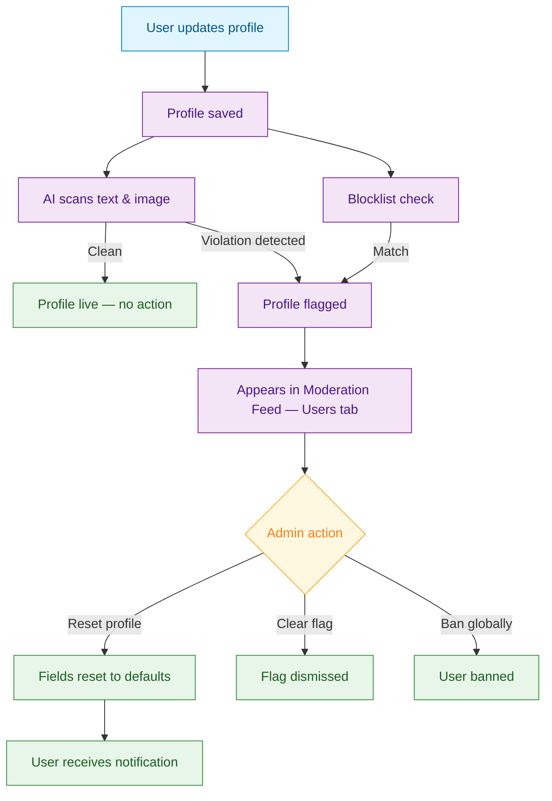

<Info>**SDK v7.x** · Last verified March 2026 · iOS · Android · Web · Flutter</Info>

<Accordion title="Speed run — just the code" icon="forward">
```typescript
// 1. Flag a user profile
await UserRepository.flagUser('userId', 'inappropriate_profile');

// 2. Unflag a user profile
await UserRepository.unflagUser('userId');

// 3. Update a user profile (triggers AI scan)
await UserRepository.updateUser('userId', {
  displayName: 'New Display Name',
  description: 'Updated bio text',
});
```
Full walkthrough below ↓
</Accordion>

<Tip>
**Platform note** — code samples below use TypeScript. Every method has an equivalent in the iOS (Swift), Android (Kotlin), and Flutter (Dart) SDKs — see the linked SDK reference in each step.
</Tip>

Content moderation catches bad posts — but what about bad profiles? Offensive display names, NSFW avatars, and scam-laden bios erode trust before a user even posts. This guide covers the full user profile moderation pipeline: AI-powered scanning, the admin review workflow, profile reset tools, and blocklists.



<Info>
**Prerequisites**: SDK installed and authenticated, Admin Console access for moderation configuration.

**Also recommended:** Complete [Content Moderation Pipeline](/use-cases/social/content-moderation-pipeline) first — user profile moderation extends the same AI and console infrastructure.
</Info>

<Note>
**After completing this guide you'll have:**
- User profile flagging via SDK (flag / unflag users)
- AI scanning of display names, descriptions, and avatars
- Admin review workflow with reset, clear, and ban actions
- Profile blocklist configured for display names and descriptions
</Note>

---

## How Profile Moderation Differs from Content Moderation

User profile moderation is **flag-only** — unlike posts and messages, flagged profiles are never auto-deleted. The block confidence threshold that auto-removes content does **not** apply to profiles. Admins must explicitly decide what to do.

| Behavior | Content (Posts / Messages) | User Profiles |
|---|---|---|
| Pre-moderation | ✅ Images blocked before upload | ✅ Avatar images blocked before upload |
| Post-moderation | ✅ AI scans after publish | ✅ AI scans after profile save |
| Auto-delete at block confidence | ✅ Content removed automatically | ❌ Never — flag only |
| Admin reset | N/A | ✅ Reset display name, avatar, description |

<Warning>
**Flag-only for profiles**: Flagged profiles always require manual admin review. This prevents automated systems from silently wiping user accounts.
</Warning>

---

## Step-by-Step Implementation

<Steps>
  <Step title="Flag a user profile from the SDK">
    Let users report profiles they find inappropriate. Flagged profiles enter the moderation queue alongside AI-flagged profiles.

    ```typescript TypeScript
    import { UserRepository } from '@amityco/ts-sdk';

    // Flag a user with a reason
    await UserRepository.flagUser('user-456');

    // Unflag if the report was a mistake
    await UserRepository.unflagUser('user-456');
    ```

    Full reference → [Content Flagging](/social-plus-sdk/social/content-management/moderation/content-flagging)
  </Step>
  <Step title="AI scanning — what gets checked">
    When a user saves profile changes, AI scans three fields automatically:

    | Field | Scan Type |
    |---|---|
    | **Display Name** | Text |
    | **Description** | Text |
    | **Avatar** (uploaded file) | Image |

    Text is scanned for: harassment, sexual content, violence, hate speech, scam promotion, self-harm, and PII (URLs, person types).

    Avatars are scanned for: nudity, suggestive imagery, violence, hate symbols, and substance-related content.

    <Warning>
    **External avatar URL gap**: Avatars set via `avatarCustomUrl` bypass the upload pipeline — no pre-moderation image scan runs. Only post-moderation scanning applies.
    </Warning>
  </Step>
  <Step title="Review flagged profiles in the Admin Console">
    Flagged profiles appear in **Admin Console → Moderation → Moderation Feed → Users** tab.

    Each flagged profile shows:
    - AI moderation labels with category counts (e.g., "Hate (2)", "Violence (1)")
    - Which field triggered the flag — display name or description
    - User report count from community members
    - Last flagged timestamp

    **Available actions:**
    - **Reset profile** — restore flagged fields to safe defaults
    - **Ban globally** — ban the user across all communities
    - **Clear flag** — dismiss the flag and approve the profile

    → [AI User Profile Moderation](/analytics-and-moderation/console/ai-user-profile-moderation)
  </Step>
  <Step title="Reset a flagged profile">
    When resetting a profile, fields are restored to safe defaults:

    | Field | Reset behavior |
    |---|---|
    | **Display Name** | Set to `{prefix}{UUID}` (e.g., `User_a1b2c3d4e5f6`) |
    | **Description** | Cleared to empty |
    | **Avatar** | Removed — reverts to default; original file deleted from storage |

    The user receives a `USER_PROFILE_RESET` notification through the notification tray informing them which fields were reset.

    <Warning>
    **Avatar reset is irreversible** — the original image file is deleted from storage. Only the reset event is logged; the original image cannot be recovered.
    </Warning>
  </Step>
  <Step title="Configure the profile blocklist">
    Block specific words and phrases from appearing in display names and descriptions.

    In **Admin Console → Moderation → Blocklist**, add terms under the **User Profile** category. This blocklist is independent from the content blocklist — you can maintain different blocked terms for profiles versus posts.

    | Blocklist Category | Applies to |
    |---|---|
    | **Content** | Posts, comments, messages |
    | **User Profile** | Display names, descriptions |
  </Step>
</Steps>

---

## Admin Console: Moderation Feed — Users Tab

The Users tab in the Moderation Feed is the central hub for profile moderation.

<Tabs>
  <Tab title="To Review">
    Displays all profiles requiring moderator attention — both AI-flagged and user-reported.

    - AI moderation labels with detected categories and occurrence counts
    - **(Profile description is flagged)** label when the description triggered the flag
    - User report counts from other community members
    - Actions: **Reset profile**, **Ban globally**, **Clear flag**
  </Tab>
  <Tab title="Reviewed">
    Displays profiles that have already been moderated, with the action taken:

    - **Flag cleared by [moderator]**
    - **Globally banned by [moderator]**
    - **Profile reset by [moderator]**

    Use the **Select moderator** filter to view actions by a specific team member.
  </Tab>
</Tabs>

---

## Confidence Thresholds

Profile moderation reuses the same confidence thresholds configured for content moderation — but only the **flag** threshold applies.

| Threshold | Applies to profiles? | Behavior |
|---|---|---|
| **Flag Confidence** (default: 40) | ✅ Yes | Profile flagged for admin review |
| **Block Confidence** (default: 80) | ❌ No | Does **not** auto-delete profile fields |

<Tip>
Start with medium flag confidence (40–60) and adjust based on false positive rates. Since profiles are never auto-deleted, a lower threshold is safer — it just means more items in the review queue.
</Tip>

---

## Webhook Automation

Profile moderation events trigger webhooks for downstream automation — sending notifications, syncing with CRM systems, or logging incidents.

```typescript Node.js
const express = require('express');
const crypto = require('crypto');
const app = express();

app.use(express.json());

app.post('/webhook', (req, res) => {
  const signature = req.headers['x-amity-signature'];
  const payload = JSON.stringify(req.body);
  const secret = process.env.WEBHOOK_SECRET;

  const expectedSig = crypto
    .createHmac('sha256', secret)
    .update(payload)
    .digest('hex');

  if (!crypto.timingSafeEqual(
    Buffer.from(signature, 'hex'),
    Buffer.from(expectedSig, 'hex')
  )) {
    return res.status(401).json({ error: 'Invalid signature' });
  }

  const { event, data } = req.body;

  switch (event) {
    case 'user.didFlag':
      notifyModerationTeam(data);
      break;
    case 'user.didBan':
      revokeAccessAcrossSystems(data.userId);
      break;
  }

  res.status(200).json({ received: true });
});
```

→ [Webhook Events Reference](/analytics-and-moderation/social+-apis-and-services/webhook-event)

---

## Common Mistakes

<Warning>
**Relying only on AI scanning without a blocklist** — AI moderation catches broad categories but may miss brand-specific terms, competitor names, or community-specific slurs. Always pair AI scanning with a curated blocklist for display names.
</Warning>

<Warning>
**Not handling `avatarCustomUrl` profiles** — Avatars set via external URLs bypass the upload pipeline and skip pre-moderation. Ensure post-moderation is enabled to catch these, and consider restricting `avatarCustomUrl` in sensitive communities.
</Warning>

<Warning>
**Auto-banning on first flag** — A single AI flag or user report may be a false positive. Use the reset action for first offenses and escalate to bans for repeat violations. Check user history for patterns before banning.
</Warning>

## Best Practices

<AccordionGroup>
  <Accordion title="Graduated enforcement" icon="stairs">
    Apply escalating actions based on violation history:
    1. **First offense** — Reset the flagged field and notify the user
    2. **Second offense** — Reset + temporary mute
    3. **Repeat violations** — Global ban

    Check the **User History** page for past moderation events before deciding on an action.
  </Accordion>
  <Accordion title="Blocklist maintenance" icon="list-check">
    - Review and update the profile blocklist monthly — slang and evasion tactics evolve
    - Add leetspeak and Unicode variants of blocked terms (e.g., `h4te`, `ⓗⓐⓣⓔ`)
    - Keep the profile blocklist separate from the content blocklist — profile terms are often different (impersonation names, brand abuse, etc.)
  </Accordion>
  <Accordion title="Team workflow" icon="users-gear">
    - Assign profile moderation to a dedicated moderator or rotation — profile flags require different judgment than content flags
    - Use the **Select moderator** filter in the Reviewed tab for audit and load-balancing
    - Document your reset-vs-ban criteria so the team is consistent
  </Accordion>
  <Accordion title="User communication" icon="comment">
    - The `USER_PROFILE_RESET` notification tells users what happened — but consider also linking to your community guidelines
    - Allow users to update their profile again after a reset — the new version will be re-scanned
    - Provide an appeal path for users who believe the reset was incorrect
  </Accordion>
</AccordionGroup>

---

<Tip>
**Dive deeper**: [AI User Profile Moderation](/analytics-and-moderation/console/ai-user-profile-moderation) has the full console reference including detection categories, threshold configuration, and admin reset details.
</Tip>

## Next Steps

<Card
  title="Your next step → Roles, Permissions & Governance"
  icon="arrow-right"
  href="/use-cases/social/roles-permissions-and-governance"
>
  Profile moderation is live — now configure who gets moderator access and what they can do.
</Card>

Or explore related guides:

<CardGroup cols={3}>
  <Card title="Content Moderation Pipeline" href="/use-cases/social/content-moderation-pipeline" icon="shield-check">
    The full content moderation loop — AI screening, user flagging, admin review, and webhook automation
  </Card>
  <Card title="User Profiles & Social Graph" href="/use-cases/social/user-profiles-and-social-graph" icon="user">
    Build the profile pages and social graph that this guide moderates
  </Card>
  <Card title="Notifications & Engagement" href="/use-cases/social/notifications-and-engagement" icon="bell">
    Configure the notification tray that delivers profile reset alerts
  </Card>
</CardGroup>
