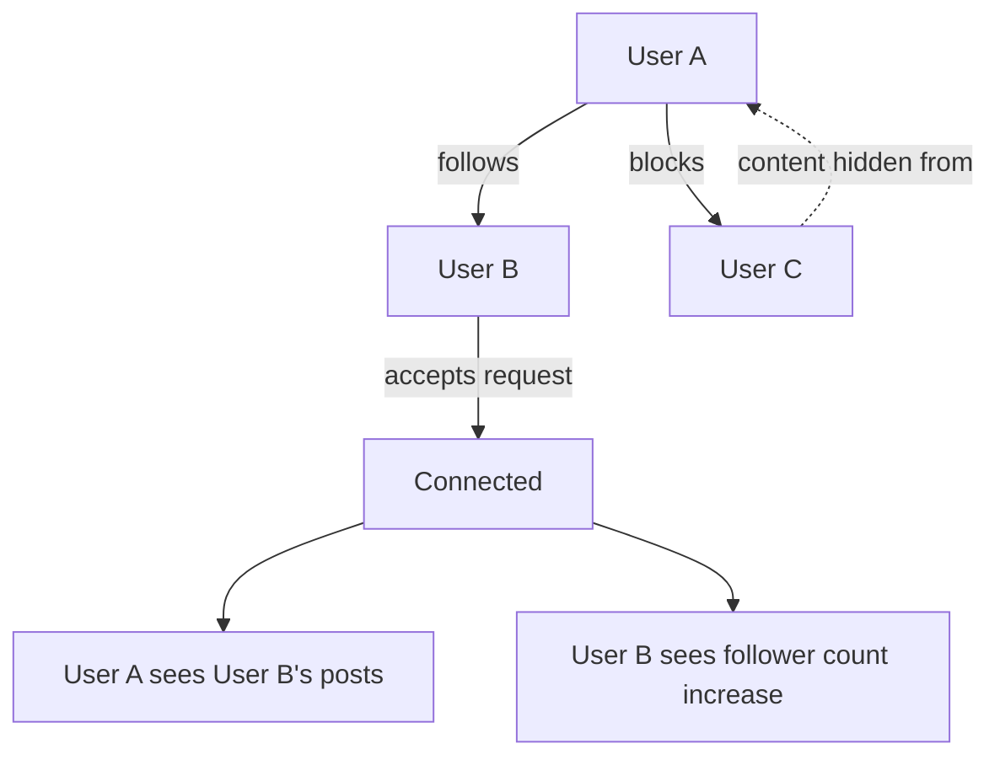

import FollowUser from '/snippets/social/relationships/follow-user.mdx';
import UnfollowUser from '/snippets/social/relationships/unfollow-user.mdx';

# User Profiles & Social Graph

A social graph connects your users to each other. This guide covers querying and displaying user profiles, building the follow/unfollow system with pending-request support, and implementing bidirectional blocking.



## What You'll Build

<CardGroup cols={2}>
  <Card title="User Profiles" icon="id-card">
    Display name, bio, avatar, follower/following counts, and recent posts
  </Card>
  <Card title="Follow System" icon="user-plus">
    Follow/unfollow with direct follow or request-based follow for private accounts
  </Card>
  <Card title="Blocking" icon="ban">
    Bidirectional block that hides content and prevents interaction between users
  </Card>
  <Card title="Social Graph Queries" icon="diagram-project">
    Query followers, following lists, and mutual connections with real-time counts
  </Card>
</CardGroup>

## Prerequisites

- SDK installed and authenticated
- Valid `userId` values for the current user and target users

---

## Quick Start: Follow a User

Use the relationship API to follow another user:

<FollowUser />

Full reference → [Follow / Unfollow User](/social-plus-sdk/social/user-relationship/following/follow-unfollow-user)

---

## Step-by-Step Implementation

<Steps>
  <Step title="Get a user profile">
    Query a user's profile to display their name, bio, avatar, and follower/following counts.

    ```typescript TypeScript
    import { UserRepository } from '@amityco/ts-sdk';

    const unsubscribe = UserRepository.getUser(userId, ({ data: user, loading }) => {
      if (user) {
        console.log(user.displayName, user.description, user.avatarFileId);
      }
    });
    ```

    Full reference → [Get User Information](/social-plus-sdk/core-concepts/user-management/user-operations/get-user-information)
  </Step>
  <Step title="Follow a user">
    For public accounts, following is immediate. For accounts with privacy settings requiring approval, this sends a follow request.

    <FollowUser />

    Full reference → [Follow / Unfollow User](/social-plus-sdk/social/user-relationship/following/follow-unfollow-user)
  </Step>
  <Step title="Unfollow a user">
    <UnfollowUser />

    Full reference → [Follow / Unfollow User](/social-plus-sdk/social/user-relationship/following/follow-unfollow-user)
  </Step>
  <Step title="Handle follow requests (request-based following)">
    When a user's account requires approval for follows, incoming requests land in a pending queue. Moderators or the target user can accept or decline.

    ```typescript TypeScript
    import { UserRepository } from '@amityco/ts-sdk';

    const isAccepted = await UserRepository.Relationship.acceptFollower('userId');
    ```

    Full reference → [Accept/Decline Follow Request](/social-plus-sdk/social/user-relationship/following/accept-decline-follow-request)
  </Step>
  <Step title="Get connection status">
    Check the relationship between two users before displaying follow/unfollow buttons. Status can be: `none`, `following`, `pending`, or `blocked`.

    ```typescript TypeScript
    import { UserRepository } from '@amityco/ts-sdk';

    const unsubscriber = UserRepository.Relationship.getFollowInfo(
      'userId',
      ({ data: followInfo }) => {
        console.log('Followers:', followInfo.followerCount);
        console.log('Following:', followInfo.followingCount);
      },
    );
    ```

    Full reference → [Get Connection Status](/social-plus-sdk/social/user-relationship/following/get-connection-status)
  </Step>
  <Step title="Get followers and following lists">
    Query paginated lists of a user's followers and the users they follow.

    ```typescript TypeScript
    import { UserRepository } from '@amityco/ts-sdk';

    const unsubscriber = UserRepository.Relationship.getFollowers(
      { userId: 'my-user-id' },
      ({ data: followers, onNextPage, hasNextPage }) => {
        if (followers) { /* render follower list */ }
      },
    );
    ```

    Full reference → [Get Follower / Following List](/social-plus-sdk/social/user-relationship/following/get-follower-following-list)
  </Step>
  <Step title="Block and unblock a user">
    Blocking is bidirectional — neither user can see the other's content or interact with them.

    ```typescript TypeScript
    import { UserRepository } from '@amityco/ts-sdk';

    await UserRepository.Relationship.blockUser('userId');
    ```

    Full reference → [Block / Unblock User](/social-plus-sdk/social/user-relationship/blocking/block-unblock-user)
  </Step>
</Steps>

---

## Connect to Moderation & Analytics

<AccordionGroup>
  <Accordion title="User flagging" icon="flag">
    Users can flag other users for abuse or spam. Flagged users appear in the Admin Console for moderator review.

    → [Flag / Unflag User](/social-plus-sdk/core-concepts/user-management/user-operations/flag-unflag-user) · [Admin Console: User Management](/analytics-and-moderation/console/management/overview)
  </Accordion>
  <Accordion title="User insights in Admin Console" icon="chart-bar">
    View per-user analytics including post count, comment count, and activity history in **Admin Console → User Management → User Insights**.
  </Accordion>
  <Accordion title="Webhook: follow events" icon="webhook">
    Receive `user.followed` and `follow.request.created` webhook events to build notification flows and sync social graph state to your backend.

    → [Webhook Events](/analytics-and-moderation/social+-apis-and-services/webhook-event)
  </Accordion>
</AccordionGroup>

---

## Best Practices

<AccordionGroup>
  <Accordion title="Privacy" icon="shield">
    - Show follower counts as rounded numbers for large accounts ("1.2K") to avoid gaming dynamics
    - Never expose private account content before a follow request is accepted
    - Let users choose between public and request-based following in their account settings
    - When a user blocks another, immediately hide the blocked user's content from all feeds client-side
  </Accordion>
  <Accordion title="UX" icon="heart">
    - Show the connection status in a single CTA button: "Follow" → "Requested" → "Following"
    - Display mutual followers ("3 people you follow also follow this account") to drive trust
    - Add empty states for users with 0 followers/following — show suggestions instead of a blank list
  </Accordion>
  <Accordion title="Performance" icon="gauge">
    - Cache the current user's following list locally for fast "is following" checks without a network call
    - Paginate follower/following lists — request 30 at a time
    - Observe user Live Objects sparingly — only subscribe when the profile screen is active
  </Accordion>
</AccordionGroup>

---

## Next Steps

<CardGroup cols={3}>
  <Card title="Build a Social Feed" href="/use-cases/social/build-a-social-feed" icon="rectangle-list">
    Show posts from followed users in a personalized feed
  </Card>
  <Card title="Notifications & Engagement" href="/use-cases/social/notifications-and-engagement" icon="bell">
    Notify users of new followers and follow requests
  </Card>
  <Card title="Community Platform" href="/use-cases/social/community-platform" icon="users">
    Manage member roles within communities
  </Card>
</CardGroup>
