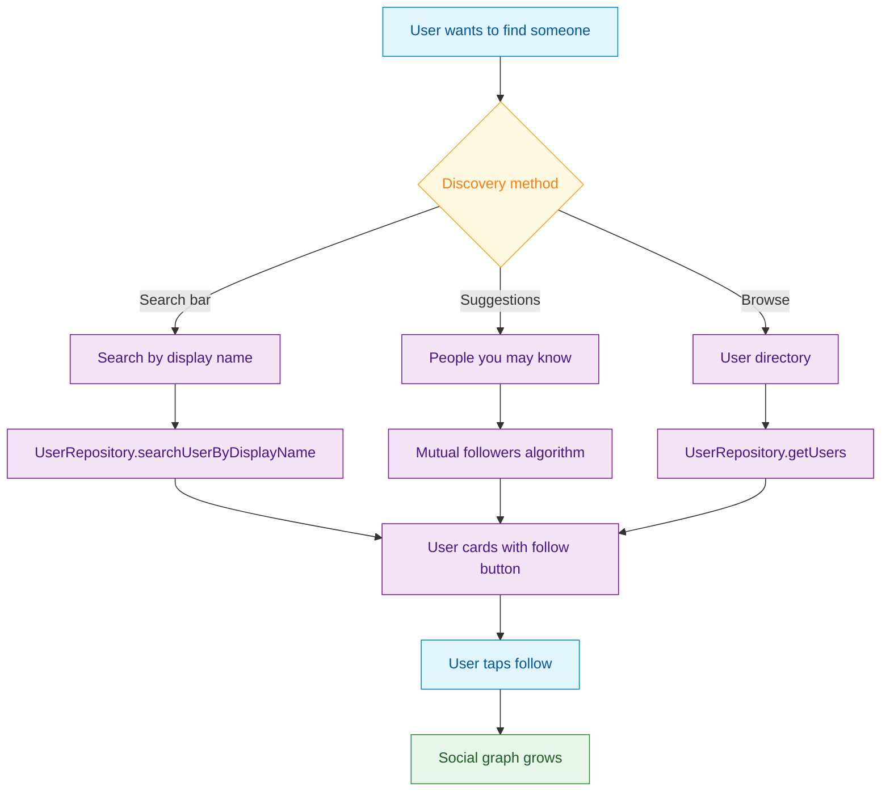

<Info>**SDK v7.x** · Last verified March 2026 · iOS · Android · Web · Flutter</Info>

<Accordion title="Speed run — just the code" icon="forward">
```typescript
// 1. Search users by display name
UserRepository.searchUserByDisplayName(
  { keyword: 'jane', limit: 20 },
  ({ data }) => { renderUsers(data); }
);

// 2. Get recommended users
const { data: suggestions } = await UserRepository.getRecommendedUsers({ limit: 10 });
```
Full walkthrough below ↓
</Accordion>

<Tip>
**Platform note** — code samples below use TypeScript. Every method has an equivalent in the iOS (Swift), Android (Kotlin), and Flutter (Dart) SDKs — see the linked SDK reference in each step.
</Tip>

The existing Search & Discovery guide covers finding posts and communities. This guide focuses on finding *people* — searching users by name, browsing user directories, and building "People you may know" features. 



<Info>
**Prerequisites**: SDK installed and authenticated → [SDK Setup](/social-plus-sdk/getting-started/overview). Users must have `displayName` set for search to work.
</Info>

<Note>
**After completing this guide you'll have:**
- Display-name user search integrated and returning paginated results
- A "People you may know" suggestion list populated from the SDK
- Follow action triggered directly from search results
</Note>

---

## Quick Start: Search Users by Name

```typescript TypeScript
import { UserRepository } from '@amityco/ts-sdk';

const unsub = UserRepository.searchUserByDisplayName(
  { displayName: 'Joe' },
  ({ data: users }) => {
    console.log(users); // Array of matching users
  },
);
```

Full reference → [Search & Query Users](/social-plus-sdk/core-concepts/user-management/user-operations/search-and-query-users)

---

## Step-by-Step Implementation

<Steps>
  <Step title="Search users by display name">
    Use `searchUserByDisplayName()` to search as the user types. Results are returned as a live collection that updates in real-time.

    ```typescript TypeScript
    import { UserRepository } from '@amityco/ts-sdk';

    const unsub = UserRepository.searchUserByDisplayName(
      { displayName: 'Joe' },
      ({ data: users, loading }) => {
        if (users) { /* render user result cards */ }
      },
    );

    // Unsubscribe when the search screen closes
    unsub();
    ```

    Full reference → [Search & Query Users](/social-plus-sdk/core-concepts/user-management/user-operations/search-and-query-users)
  </Step>
  <Step title="Browse all users (directory)">
    Query all users with pagination for a "People" directory or admin user list.

    ```typescript TypeScript
    import { UserRepository } from '@amityco/ts-sdk';

    const unsubscribe = UserRepository.getUsers(
      {},
      ({ data: users, onNextPage, hasNextPage, loading }) => {
        if (users) { /* render user list */ }
        // Load more: if (hasNextPage) onNextPage?.();
      },
    );
    ```

    Full reference → [Search & Query Users](/social-plus-sdk/core-concepts/user-management/user-operations/search-and-query-users)
  </Step>
  <Step title="Get user details for result cards">
    For each search result, display their avatar, display name, bio, and follower count by querying the user profile.

    ```typescript TypeScript
    import { UserRepository } from '@amityco/ts-sdk';

    const unsubscribe = UserRepository.getUser(userId, ({ data: user }) => {
      if (user) {
        console.log(user.displayName, user.description, user.avatarFileId);
      }
    });
    ```

    Full reference → [Get User Information](/social-plus-sdk/core-concepts/user-management/user-operations/get-user-information)
  </Step>
  <Step title="Add follow button to user cards">
    Check the connection status and show the right button state: "Follow", "Requested", or "Following".

    ```typescript TypeScript
    import { UserRepository } from '@amityco/ts-sdk';

    const unsubscriber = UserRepository.Relationship.getFollowInfo(
      userId,
      ({ data: followInfo }) => {
        console.log('Status:', followInfo.status); // 'none' | 'following' | 'pending'
        console.log('Followers:', followInfo.followerCount);
      },
    );
    ```

    Full reference → [Get Connection Status](/social-plus-sdk/social/user-relationship/following/get-connection-status) · [Follow / Unfollow User](/social-plus-sdk/social/user-relationship/following/follow-unfollow-user)
  </Step>
  <Step title="Build 'People you may know' suggestions">
    Combine multiple signals to suggest relevant connections: mutual followers, shared community membership, and activity patterns.

    ```typescript TypeScript
    // Strategy: Find users in the same communities who aren't followed yet
    import { CommunityRepository, UserRepository } from '@amityco/ts-sdk';

    // 1. Get the user's communities
    const communities = await getUserCommunities(currentUserId);

    // 2. Get members from those communities
    const members = await getCommunityMembers(communities[0].communityId);

    // 3. Filter out users already followed
    const suggestions = members.filter(m => !followedUserIds.has(m.userId));
    ```
  </Step>
</Steps>

---

## Connect to Moderation & Analytics

<AccordionGroup>
  <Accordion title="Search analytics" icon="chart-bar">
    Track what users search for in **Admin Console → Analytics → Search Insights**. High-frequency searches with 0 results indicate missing content or users.
  </Accordion>
  <Accordion title="User flagging from search" icon="flag">
    Search results should include a "Report" action. Flagged users appear in the Admin Console moderation queue.

    → [Flag / Unflag User](/social-plus-sdk/core-concepts/user-management/user-operations/flag-unflag-user)
  </Accordion>
  <Accordion title="Visitor filtering" icon="eye-slash">
    Visitor and bot users are automatically excluded from search results. Only authenticated (`SIGNED_IN`) users appear in `searchUserByDisplayName()` results.
  </Accordion>
</AccordionGroup>

---

## Common Mistakes

<Warning>
**Searching with an empty string** — An empty keyword returns no results or throws an error. Disable the search button or show suggestions when the input is empty.
</Warning>

<Warning>
**Not paginating search results** — Popular names can match hundreds of users. Always set a `limit` and implement "Load more" for additional pages.
</Warning>

<Warning>
**Showing stale follow status in search results** — The follow relationship may have changed since the list was fetched. Verify the relationship status when the user opens a profile from search results.
</Warning>

## Best Practices

<AccordionGroup>
  <Accordion title="Search UX" icon="magnifying-glass">
    - Add a 300ms debounce before firing the search query — prevents excessive API calls while typing
    - Show recent searches and suggested users before the user starts typing
    - Display skeleton placeholders while results load
    - Show "No users found" with a suggestion to try a different name if the query returns 0 results
    - Highlight the matching portion of the display name in results (bold "Joe" in "Joey Smith")
  </Accordion>
  <Accordion title="User cards" icon="id-card">
    - Show avatar + display name + short bio (first 50 characters) + follower count
    - Include a single CTA button: "Follow" / "Requested" / "Following" based on connection status
    - Show a verified badge or role badge (e.g., "Moderator") for users with special roles
    - Cache user cards for recently viewed profiles to avoid re-fetching on back navigation
  </Accordion>
  <Accordion title="Performance" icon="gauge">
    - Limit search results to 20 items; use pagination for deeper results
    - Unsubscribe the search live collection when the search screen closes
    - For "People you may know", compute suggestions server-side or cache them — don't recompute on every render
    - Pre-fetch connection status for visible users in batch rather than one-by-one
  </Accordion>
</AccordionGroup>

---

<Tip>
**Dive deeper**: [Discovery & Engagement API Reference](/social-plus-sdk/social/discovery-engagement/overview) has full parameter tables, method signatures, and platform-specific details for every API used in this guide.
</Tip>

## Next Steps

<Card
  title="Your next step → User Profiles & Social Graph"
  icon="arrow-right"
  href="/use-cases/social/user-profiles-and-social-graph"
>
  Users can find each other — now build rich profiles with avatars, bios, and follow connections.
</Card>

Or explore related guides:

<CardGroup cols={3}>
  <Card title="User Profiles & Social Graph" href="/use-cases/social/user-profiles-and-social-graph" icon="user-group">
    Build the profile page users navigate to from search
  </Card>
  <Card title="Search & Discovery" href="/use-cases/social/search-and-discovery" icon="magnifying-glass">
    Search posts and communities alongside users
  </Card>
  <Card title="Community Platform" href="/use-cases/social/community-platform" icon="users">
    Discover users within communities
  </Card>
</CardGroup>
